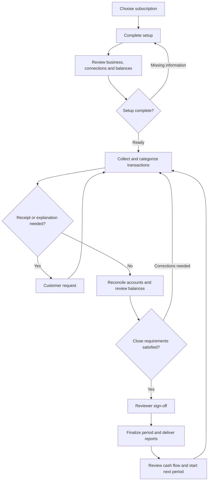

The reference opens **Bookkeeping Subscriptions — Business Dashboard**. I reviewed **38 linked product pages: 16 customer pages and 22 administrative pages**, plus the Product Catalog, and walked through all **11 setup steps**.

The journey below covers the linked screens, customer actions, bookkeeper handoffs, monthly close, reporting, and exception paths. The product uses sample data. **Saving, submitting onboarding, approving accounting changes, finalizing periods, and external integrations were not tested.** Where a transition is implied by the screens, I describe it as intended behavior.

**1. Overall journey**

The business owner’s goal is to keep books current, answer outstanding questions, complete the monthly close, and receive understandable financial reports. The bookkeeper prepares the records; the reviewer checks their completeness and authorizes finalization.

| User                     | Responsibility                                                              | Successful outcome                                         |
| ------------------------ | --------------------------------------------------------------------------- | ---------------------------------------------------------- |
| Business owner/contact   | Provide company information, documents, explanations, and approvals         | Current books and clear outstanding actions                |
| Bookkeeper               | Categorize transactions, reconcile accounts, manage requests, prepare close | Complete records ready for review                          |
| Reviewer                 | Check balances, exceptions, and close readiness                             | Supported finalization decision                            |
| Operations administrator | Assign staff, maintain scope, oversee queues and access                     | Work delivered within the agreed service scope             |
| Reporting recipient      | Review financial statements and cash-flow information                       | Understand the period’s results and unresolved limitations |

**2. Enter the product and select a service**

| Linked page                                                                                  | User actions                                                                                                                                                                           | Next step                                             |
| -------------------------------------------------------------------------------------------- | -------------------------------------------------------------------------------------------------------------------------------------------------------------------------------------- | ----------------------------------------------------- |
| [Business Dashboard](https://www.xenhey.com/api/store/1163B715C77D4D9084125C6788A0F919)      | Review books-current-through date, accounting basis, close progress, reconciled accounts, missing receipts, category questions, assigned bookkeeper, subscription, and latest reports. | Open the task requiring attention.                    |
| [Subscription overview](https://www.xenhey.com/api/store/E5766072480F40C581A7AF525E8344AF)   | Compare plans, review transaction/account limits, contact bookkeeping, or choose a plan.                                                                                               | Enter Set Up Books.                                   |
| [Product Catalog](https://www.xenhey.com/api/store/AF1EF7DFD5754E6289D4787214A96410#catalog) | Return to the broader financial-product catalog.                                                                                                                                       | Enter or leave the Bookkeeping Subscriptions journey. |

The overview displays these **prototype prices and inclusions**:

| Plan                     | Displayed monthly price | Transactions | Connected accounts | Displayed scope                                                                     |
| ------------------------ | ----------------------: | -----------: | -----------------: | ----------------------------------------------------------------------------------- |
| Essential Books          |                    $349 |          250 |                  4 | Monthly categorization and reconciliation; email support; cleanup quoted separately |
| Books + Close            |                    $699 |          500 |                  8 | Structured close and statements; priority support; historical cleanup available     |
| Full-Service Finance Ops |                  $1,299 |        1,000 |                 15 | A/R, A/P, cash flow, and year-end; dedicated bookkeeper                             |

The page states that cleanup and out-of-scope work require approval. These displayed amounts should be treated as prototype configuration, not a verified commercial quote.

Selecting **Books + Close** navigated to the setup page with the plan in the URL. The selected plan was not visibly confirmed in the setup content inspected.

**Intended outcome:** Before proceeding, the customer understands the included work, limits, close cadence, support arrangement, and treatment of historical cleanup.

**3. Complete the 11-step setup**

The [Set Up Books wizard](https://www.xenhey.com/api/store/ECAADB80050E4465A1164E2D69ED753D) provides completion progress, last-saved information, missing-field summaries, step navigation, **Save and exit**, and an editable final review.

| Step                                | Observed information                                                                                                                          | Journey purpose                                            |
| ----------------------------------- | --------------------------------------------------------------------------------------------------------------------------------------------- | ---------------------------------------------------------- |
| **1. Business**                     | Legal business name, DBA, entity type, formation state, industry, reporting contact email                                                     | Establish the business and reporting contact               |
| **2. Accounting**                   | Fiscal year-end, accounting method, cash/accrual reporting basis, books-current-through date, monthly close deadline                          | Define how and when the books are maintained               |
| **3. Current System**               | Current accounting platform, conversion requirement, historical periods, current bookkeeper status, service scope                             | Identify migration and cleanup needs                       |
| **4. Chart of Accounts**            | Account count, tracking dimensions, department/project tracking requirements, chart cleanup status                                            | Establish account structure and reporting dimensions       |
| **5. Opening Balances**             | Opening balance date, trial balance and balance sheet availability, outstanding checks, open invoices/bills                                   | Establish a supported starting point                       |
| **6. Sales and Receivables**        | Sales channels, invoice volume, payment-processor count, deposit matching and receivables-aging requirements                                  | Describe revenue and collection workflows                  |
| **7. Purchases and Payables**       | Vendor count, monthly bill count, expense workflow, bill approval and payables-aging requirements                                             | Describe purchasing and liability workflows                |
| **8. Connections**                  | Bank, credit, and loan account counts; payroll provider; connection-token status; masked-reference readiness                                  | Identify the integrations and accounts needed              |
| **9. Reporting**                    | Reporting cadence, income statement/balance sheet/cash-flow requirements, sales-tax workpapers, year-end package                              | Define expected deliverables                               |
| **10. Documents and Authorization** | Source-document readiness, delivery method, retention-policy status, books-access authorization, scope acknowledgment, accuracy certification | Confirm information readiness and authorized service scope |
| **11. Review and Submit**           | Summaries of the preceding sections, **Edit section**, and **Submit onboarding**                                                              | Correct omissions and submit a coherent setup record       |

The intended sequence is:

1. Complete business and accounting information.
2. Identify conversion, historical cleanup, and scope requirements.
3. Establish accounts and opening balances.
4. Define sales, expenses, integrations, and reports.
5. Review authorizations and supporting information.
6. Submit and receive a stable onboarding reference.
7. Resolve any questions raised by the bookkeeping team.

The prototype explicitly directs users to keep banking credentials, government identifiers, tax IDs, and source-document contents out of the browser prototype.

**4. Track onboarding and establish reliable books**

| Linked page                                                                                | Customer journey                                                                                                                                         | Bookkeeper handoff                                           |
| ------------------------------------------------------------------------------------------ | -------------------------------------------------------------------------------------------------------------------------------------------------------- | ------------------------------------------------------------ |
| [Onboarding Status](https://www.xenhey.com/api/store/42F1B14572E648F0BEC170423381FA71)     | Follow Discovery → Connections → Opening Balances → Categorization → Reconciliation → Close Ready. Review the next action and select **Continue setup**. | Review the updated information and advance readiness.        |
| [Company Profile](https://www.xenhey.com/api/store/36586235C5D249A9840CD311B32AC5CC)       | Maintain business name, entity type, fiscal year-end, accounting method, reporting basis, and contact email.                                             | Keep the operating record consistent with setup.             |
| [Financial Connections](https://www.xenhey.com/api/store/245DB32E74BF446999E41BA6120E6FBC) | Inspect institution, masked account reference, account type, connection status, and last sync date.                                                      | Resolve Pending or Needs attention connections.              |
| [Chart of Accounts](https://www.xenhey.com/api/store/38E9DCE091BB4868B1AADA8EB912C14B)     | Review account names, categories/subcategories, tracking dimensions, opening-balance status, and review status.                                          | Resolve mapping, duplicate, or uncategorized-account issues. |

The sample onboarding page asks the customer to confirm starting balances and resolve outstanding receipt requests.

**Recommended readiness condition:** The selected service scope, account structure, opening balances, required connections, and outstanding setup questions should be reviewed before the first monthly close.

**5. Review transactions and resolve questions**

The [Transactions page](https://www.xenhey.com/api/store/E782B412254F4F2DA04CA22460486296) shows transaction date, description, amount, proposed category, receipt condition, and review status.

Its displayed statuses are **Suggested, Needs receipt, Question sent, Approved, and Matched**.

The transaction-detail panel includes:

* Description and amount.
* Proposed and approved categories.
* Receipt status.
* **Approve category**, **Split transaction**, **Match transaction**, **Attach receipt**, **Ask customer**, and **View history**.

The intended journey is:

1. Find a transaction requiring review.
2. Inspect its description, amount, category, and source evidence.
3. Confirm the category or explain the correct treatment.
4. Split the transaction when different portions need different categories.
5. Match related activity where appropriate.
6. Supply a missing receipt or answer a bookkeeping question.
7. Retain the decision and evidence with the transaction.

The sample transaction panel displayed both a proposed and an approved category while the transaction remained **Suggested** and its receipt was missing. The final design should make clear which values are suggestions and which have actually been approved.

**Customer question:** “What information do you need from me to complete this transaction?”

**6. Complete the receipt and customer-request loop**

[Receipts & Requests](https://www.xenhey.com/api/store/83C419F6C1BF42ECA1BAF2DFEAD5239F) displays request reference, company, status, document condition, due date, and owner.

| Request state       | Intended action                                         |
| ------------------- | ------------------------------------------------------- |
| Open                | Review and assign the request                           |
| Waiting on customer | Customer supplies the requested evidence or explanation |
| Received            | Bookkeeper checks the response                          |
| Resolved            | The response has addressed the underlying issue         |

The complete journey should be:

1. A transaction or close task identifies missing information.
2. The bookkeeper creates a request tied to that record.
3. The customer sees what is missing, why it matters, and when it is due.
4. The customer responds through the approved document channel.
5. The bookkeeper accepts the response or requests clarification.
6. The transaction and close blocker update accordingly.

The administrative [Customer Requests queue](https://www.xenhey.com/api/store/D11EF78984624406A950320CC7B55272) supports triage by status, owner, and due date. Actual document upload, messaging, and automatic blocker resolution were not demonstrated.

**7. Reconcile accounts**

On [Reconciliations](https://www.xenhey.com/api/store/7047A907267E4CF6BD44F17977F7364D), the user compares statement and book balances and investigates outstanding items.

The inspected example displayed:

| Item                     |     Amount |
| ------------------------ | ---------: |
| Statement ending balance | $21,736.50 |
| Adjusted book balance    | $21,639.82 |
| Calculated difference    |     $96.68 |

The page explicitly says to resolve the difference before finalizing.

The intended reconciliation journey is:

1. Select the account and statement end date.
2. Confirm the statement ending balance.
3. Compare it with the book balance.
4. Review deposits in transit, outstanding payments, bank-only fees, and book-only corrections.
5. Resolve or document each difference.
6. Save the reconciliation.
7. Obtain review and finalize when the calculated difference is zero.

Observed reconciliation states are **Not started, In progress, Needs review, and Reconciled**. The zero-difference requirement is stated in the interface; its enforcement was not tested.

**8. Review receivables, payables, and cash flow**

| Linked page                                                                              | Customer actions                                                                                         | Expected result                                             |
| ---------------------------------------------------------------------------------------- | -------------------------------------------------------------------------------------------------------- | ----------------------------------------------------------- |
| [Accounts Receivable](https://www.xenhey.com/api/store/F7FDA0C59A2B43639B3A7D4F1A8E9AED) | Review customer/invoice references, invoice date, due date, open amount, and collection status.          | Identify current, due-soon, overdue, and paid invoices.     |
| [Accounts Payable](https://www.xenhey.com/api/store/689A517ED5DB4BF2881A36CB7A3CE387)    | Review vendor/bill references, bill date, due date, open amount, and approval status.                    | Identify pending, approved, and paid bills.                 |
| [Cash-Flow Insights](https://www.xenhey.com/api/store/BE17ED26A0B240C598C135FD1274EEE8)  | Enter forecast period, opening cash, expected receipts/payments, minimum cash target, and scenario type. | Assess expected cash availability and potential shortfalls. |

These pages expose record forms. They do not demonstrate invoice delivery, collection activity, bill-payment execution, or a calculated cash-flow visualization.

The intended monthly handoff is to resolve unexplained balances, confirm expected receipts and payments, and incorporate the reviewed information into close and reporting.

**9. Complete month-end close**

The [Month-End Close page](https://www.xenhey.com/api/store/ED660BBB6C9A4FD7895505F8A34C4C6F) presents progress, blocked tasks, reviewer sign-off, finalized periods, and a checklist with owners, blockers, due dates, comments, and record links.

Its checklist includes:

| Task                     | Required outcome                                     |
| ------------------------ | ---------------------------------------------------- |
| Collect source documents | Required evidence received and reviewed              |
| Approve categories       | Transaction classifications resolved                 |
| Reconcile accounts       | Differences resolved and reconciliations reviewed    |
| Review receivables       | Open customer balances explained                     |
| Finalize statements      | Reviewer requirements satisfied and reports prepared |

The displayed close lifecycle is:

**Collecting documents → Transaction review → Reconciliation → Reviewer sign-off → Finalized**

The page also exposes **Reopen period**. The intended reopening journey should require an authorized user, a reason, affected-record identification, renewed review, and a new report version. Those controls were not verified.

**Business owner question:** “What is preventing this month from closing, who owns it, and what must I do?”

**10. Receive reports and manage the service**

[Financial Reports](https://www.xenhey.com/api/store/ED8DC23076634E9780904675EDD12510) displays report cards for:

| Report           | User purpose                                    |
| ---------------- | ----------------------------------------------- |
| Income Statement | Review income, expenses, and period performance |
| Balance Sheet    | Review assets, liabilities, and equity          |
| Trial Balance    | Inspect account balances                        |
| General Ledger   | Review detailed accounting activity             |
| A/R Aging        | Understand outstanding customer balances        |

Cards show the period, accounting basis, preparation status, **Preview**, and **Download**.

The intended delivery journey is to select a period, distinguish draft from finalized reports, review the accounting basis, inspect supporting detail, and download the approved version.

On [Support](https://www.xenhey.com/api/store/EAEAFB761BD44B3CAD32177C754B6AEE), the customer supplies category, priority, subject, and description. Priorities are **Normal, High, and Urgent**.

Subscription management is less complete:

* **Manage subscription** routes to Company Profile.
* **View agreement** displayed an “Agreement opened” notification.
* **Download invoice** is exposed on the overview, but invoice retrieval was not tested.
* A dedicated plan-change, cancellation, or billing-history page was not discovered.

**11. Administrative journey — all linked workspaces**

The following pages support the customer journey. Their forms establish the intended responsibilities; they do not prove automated routing or enforced approvals.

**Client intake, assignment, and setup review**

| Linked page                                                                                                                   | Administrative activity                                                                                                                                        |
| ----------------------------------------------------------------------------------------------------------------------------- | -------------------------------------------------------------------------------------------------------------------------------------------------------------- |
| [Admin Dashboard](https://www.xenhey.com/api/store/00507C2AA37145A7BF3829D586F6F091)                                          | Prioritize onboarding, transaction review, reconciliation, close review, exceptions, and customer requests.                                                    |
| [Clients](https://www.xenhey.com/api/store/15C19F0E9DB94515BBC9F1ADBC4A0D80)                                                  | Search/filter clients and open their records.                                                                                                                  |
| [Client Details — sample record](https://www.xenhey.com/api/store/6318A8EEDD7742DF8D1CD45D33AFB934?recordId=BK-20260913-0001) | Review plan, assigned bookkeeper, close progress, reconciliation, requests, and report status. Assign bookkeeper/reviewer, priority, plan, and close deadline. |
| [Onboarding Queue](https://www.xenhey.com/api/store/647172FB12DA42F4839E925833CAF36D)                                         | Review onboarding status and notes; request missing information.                                                                                               |
| [Business Review](https://www.xenhey.com/api/store/4DBA09929D544DFEBDC1AF2ABE10BDDC)                                          | Check entity, reporting contact, fiscal year, accounting method, and service scope.                                                                            |
| [Connection Review](https://www.xenhey.com/api/store/A8A366C1618F43338B3042DA733E655A)                                        | Inspect provider, masked account, connection status, and last successful sync.                                                                                 |
| [Opening Balances](https://www.xenhey.com/api/store/FF1714AFE7FC4D8ABA34BB5FDAE4B34A)                                         | Review assets, liabilities, equity, as-of date, and out-of-balance amount.                                                                                     |
| [Chart Review](https://www.xenhey.com/api/store/08DA40EE5D95405CA700AD0FF61CBEB1)                                             | Review duplicate/uncategorized accounts, mapping status, and account structure.                                                                                |

The record-specific Client Details link did load the expected company, plan, bookkeeper, and close information.

**Monthly preparation and review**

| Linked page                                                                                | Administrative activity                                                                           |
| ------------------------------------------------------------------------------------------ | ------------------------------------------------------------------------------------------------- |
| [Transaction Review](https://www.xenhey.com/api/store/83213C82E6E64420991FACBF63BAAEF7)    | Review transaction volume, uncategorized items, document exceptions, and review status.           |
| [Reconciliation Review](https://www.xenhey.com/api/store/8CB97794A12344E9B2E88CEE9045C43B) | Review account, statement date, difference amount, stale items, and decision.                     |
| [Receivables Review](https://www.xenhey.com/api/store/E3C40932FC8E4A9B9FDAF9684F110384)    | Review open invoices, overdue amounts, and credit balances.                                       |
| [Payables Review](https://www.xenhey.com/api/store/C51FA4AFA72F43CDAD0752F560BBCC99)       | Review open bills, past-due amounts, and unapplied payments.                                      |
| [Close Review](https://www.xenhey.com/api/store/080FAE9D11384281B7D06B778EC4C6CB)          | Check transaction/reconciliation/reviewer status and choose Continue review, Finalize, or Reopen. |
| [Financial Statements](https://www.xenhey.com/api/store/A373461A9C544EBA84C27F7836F7E0D5)  | Track statement preparation and delivery; exposes **Run report**.                                 |

**Exceptions, customer follow-up, and quality**

| Linked page                                                                            | Administrative activity                                                          |
| -------------------------------------------------------------------------------------- | -------------------------------------------------------------------------------- |
| [Exceptions](https://www.xenhey.com/api/store/BE0E6CD4D6D24119A5376379D88A4B33)        | Identify exception, severity, affected record, resolution state, and notes.      |
| [Quality Control](https://www.xenhey.com/api/store/E4ECEE274414460EB2633C74362619A7)   | Record review period, sample size, exception count, quality decision, and notes. |
| [Customer Requests](https://www.xenhey.com/api/store/D11EF78984624406A950320CC7B55272) | Triage missing documents and questions by status, owner, and due date.           |

**Periodic deliverables and oversight**

| Linked page                                                                               | Administrative activity                                                                                                                    |
| ----------------------------------------------------------------------------------------- | ------------------------------------------------------------------------------------------------------------------------------------------ |
| [Sales-Tax Workpapers](https://www.xenhey.com/api/store/890BE386D1274A969254D2C99BC1C555) | Track filing period, jurisdiction count, taxable sales, tax collected, and workpaper status. This does not establish tax-filing execution. |
| [Year-End Package](https://www.xenhey.com/api/store/EEE4E90241424110B293AE926644FAAF)     | Track general ledger, trial balance, contractor report, and package readiness.                                                             |
| [Commissions](https://www.xenhey.com/api/store/70E74548057C46BBB6DCB2B02316453E)          | Maintain referral/client references, service plan, commission amount/status, and payment date.                                             |
| [Administration](https://www.xenhey.com/api/store/AD83A1EB72F248A1B7233022E9FEEEB4)       | Maintain user name/email, role, account status, MFA requirement, and session timeout.                                                      |
| [Audit History](https://www.xenhey.com/api/store/8CB33F2E4AB345D2A1CA10682873BF40)        | Exposes event-type, actor, date-range, and record-reference fields. A detailed immutable event history was not demonstrated.               |

**12. Exception paths and expected resolution**

| Trigger                          | Intended journey                                                            | Resolution condition                               |
| -------------------------------- | --------------------------------------------------------------------------- | -------------------------------------------------- |
| Connection needs attention       | Connections → Connection Review → restore approved connection → verify sync | Required activity is available without duplication |
| Opening balances do not agree    | Setup → Opening Balances → customer clarification → reviewer check          | Starting balances are supported and approved       |
| Missing receipt                  | Transactions → Receipts & Requests → Customer Requests → review response    | Evidence accepted and blocker resolved             |
| Unclear category                 | Transaction review → customer explanation → category decision               | Approved classification retained with context      |
| Reconciliation difference        | Reconciliations → outstanding items → Reconciliation Review                 | Difference resolved and reviewed                   |
| Overdue receivable               | Accounts Receivable → Receivables Review → customer follow-up               | Balance and collection status accurately explained |
| Close deadline at risk           | Month-End Close → request/exception owner → escalation                      | Clear revised action plan and deadline             |
| Error after finalization         | Authorized reopening → correction → repeat review → reissue reports         | New version traceable to the original              |
| Historical cleanup outside scope | Current System/service scope → business review → customer approval          | Scope and commercial terms agreed before work      |

**13. Observed gaps to address**

| Finding                                                                                                                      | Journey impact                                                                      | Recommended improvement                                                           |
| ---------------------------------------------------------------------------------------------------------------------------- | ----------------------------------------------------------------------------------- | --------------------------------------------------------------------------------- |
| **View history**, report **Preview**, and **View agreement** displayed notifications without opening their promised content. | Users cannot verify history, statements, or terms.                                  | Provide actual detail views and documents.                                        |
| **Manage subscription** opens Company Profile.                                                                               | Plan changes, invoices, and service limits lack a clear destination.                | Add a dedicated subscription workspace.                                           |
| Selected plan appears in the setup URL but was not visibly confirmed.                                                        | Customers may be uncertain which service they are configuring.                      | Show the chosen plan and scope throughout setup and review.                       |
| Reporting cadence, document-delivery method, scenario type, and exception type contain generic status values.                | Choices do not fit their purpose.                                                   | Use task-specific options.                                                        |
| A/R, A/P, connections, and chart pages reuse a generic company/close table.                                                  | Users cannot easily inspect the relevant invoices, bills, accounts, or connections. | Provide entity-specific lists and details.                                        |
| Some transactions say **Needs receipt** while the receipt field says **Attached** or **Not required**.                       | Required action is ambiguous.                                                       | Explain whether evidence is missing, rejected, or awaiting review.                |
| Report cards for the same period alternate between Cash and Accrual.                                                         | Users may compare incompatible results.                                             | Make the selected basis explicit and consistent, or clearly explain alternatives. |
| Dashboard and other pages show different close percentages and record counts with differing scopes.                          | Users may assume all numbers describe the same client and period.                   | Label portfolio, client, period, and filter scope consistently.                   |
| The inspected September close target was September 15, while the review date was September 19.                               | Overdue work is not clearly escalated.                                              | Show overdue indicators and actionable ownership.                                 |

The central acceptance criterion is continuity: **the same client, account, transaction, document request, reporting period, accounting basis, and review decision should remain connected from setup through finalized reports.**
