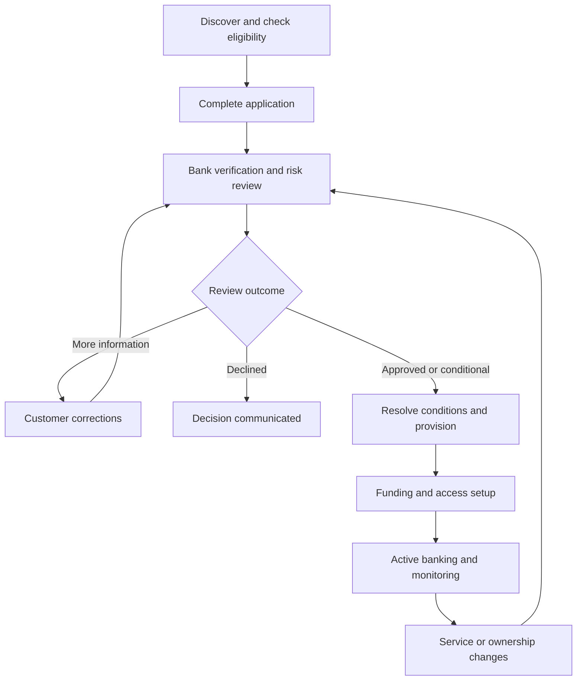

# Business Checking Accounts: Detailed User Journey

The referenced product is a **Business Checking application and banking-operations prototype**. I inspected **70 Business Checking pages—24 customer pages and 46 administrative pages—plus the linked product-catalog entry**, and walked through all ten application steps.

This journey covers the product’s linked pages, customer actions, administrative reviews, and handoffs. **The pages and fields below were observed; proposed outcomes and handoffs are recommendations, not confirmation that backend processing is implemented.** I did not submit applications, save changes, accept agreements, or execute transactions.

## 1. Journey overview

The experience serves four primary roles:

| Role                           | Primary objective                                                                                |
| ------------------------------ | ------------------------------------------------------------------------------------------------ |
| Business applicant             | Select an account, complete the application, and resolve verification requests.                  |
| Business banking administrator | Manage users, payment permissions, treasury services, and account controls.                      |
| Payment initiator or approver  | Prepare or review payments within assigned permissions.                                          |
| Bank operations reviewer       | Verify the business, assess risk, approve services, provision the account, and monitor activity. |

The final diagram is a recommended operating sequence grounded in the available screens. Some reviews can run in parallel.

---

## 2. Entry journey: Discover the product and choose a starting point

### Product introduction

Start at [Business Checking Accounts](https://www.xenhey.com/api/store/38B7E8F83C384519A3A4518E555BF9E4).

The customer learns that the product supports account opening, funding, payment approvals, role-based access, and treasury services. The page advertises a **12–18-minute application**, draft saving, and secure-document handoff.

The customer chooses:

* **Start application:** enter the ten-step intake.
* **Check eligibility:** provide preliminary business and account requirements.
* **Dashboard:** review existing applications or representative account activity.
* **Product Catalog:** leave Business Checking to explore other financial products.

The [Product Catalog](https://www.xenhey.com/api/store/AF1EF7DFD5754E6289D4787214A96410#catalog) is a cross-product exit. Other financial products are outside this Business Checking journey.

### Dashboard

The supplied [Customer Dashboard](https://www.xenhey.com/api/store/E15F2B19B128485497B07997600D9F85) combines application tracking and a representative active-account experience.

The user sees:

* An application-status banner and outstanding items.
* Available, current, and pending balances.
* Money-in and money-out summaries.
* Recent transactions.
* Payment-approval, alert, active-user, and treasury-service indicators.
* A searchable application table with status, product, and date filters.
* Edit links to the application intake.

### Verified shortcut destinations

| Dashboard action             | Destination                              | User purpose                                   |
| ---------------------------- | ---------------------------------------- | ---------------------------------------------- |
| View application             | Application Status                       | Understand outstanding requirements.           |
| View transactions / View all | Reporting                                | Review reporting and transaction information.  |
| Transfer / Pay bill          | Account Services                         | Prepare an account-service request.            |
| Send wire                    | Wire Services                            | Review wire-service requirements and controls. |
| Deposit check                | Remote Deposit                           | Configure deposit requirements.                |
| Edit application             | Open an Account, with a record reference | Resume a selected application.                 |

**Important distinction:** these shortcuts lead to prototype forms. Their labels alone do not establish that actual transfers, bill payments, wires, or check-image deposits are implemented.

---

## 3. New-customer journey: Complete the ten-step application

Open [Open an Account](https://www.xenhey.com/api/store/6F13C4E80ADE4D608342124D5FC476A2).

The wizard displays an application reference, estimated time, completion indicator, step navigation, missing-information summary, and **Previous**, **Save draft**, and **Continue** controls. The final step presents **Submit for review**.

### Detailed step-by-step walkthrough

| Step                            | Customer action and observed fields                                                                                                                                                                                | Intended outcome                                                                     |
| ------------------------------- | ------------------------------------------------------------------------------------------------------------------------------------------------------------------------------------------------------------------ | ------------------------------------------------------------------------------------ |
| **1. Eligibility**              | Select application type: new relationship, existing customer/new account, additional account, or conversion. Select referral source and requested opening date.                                                    | Establish the application context and routing.                                       |
| **2. Business profile**         | Enter legal name, DBA, entity type, formation state, years in business, business city/state, industry, description, and business contact email.                                                                    | Create the business profile used in verification.                                    |
| **3. Ownership and control**    | Select the count of owners holding 25% or more; record beneficial-ownership, control-person, and identity-verification statuses; acknowledge secure certification.                                                 | Establish ownership-review requirements without entering sensitive identity details. |
| **4. Account selection**        | Choose Business Essentials Checking, Business Growth Checking, or Analyzed Business Checking. Select purpose, opening-deposit band, monthly-balance band, and balance pattern.                                     | Identify the requested product and expected account use.                             |
| **5. Expected transactions**    | Select incoming/outgoing transaction counts; cash, check, ACH credit/debit, and domestic-wire bands; international-wire and foreign-country activity.                                                              | Establish an expected-activity baseline for bank review.                             |
| **6. Authorized signers**       | Select signer count, signer status, dual-approval preference, and transaction-limit profile.                                                                                                                       | Describe who can act for the business and the requested controls.                    |
| **7. Digital-banking users**    | Select administrator status and online-user count; request online banking, mobile banking, bill pay, and alerts.                                                                                                   | Define digital-access needs.                                                         |
| **8. Treasury services**        | Request ACH, wires, Positive Pay, remote deposit, and debit cards.                                                                                                                                                 | Identify services requiring separate approval and setup.                             |
| **9. Documents**                | Record formation, tax-ID, address, and licensing verification statuses; select document-checklist status; acknowledge secure evidence submission.                                                                  | Track evidence readiness through references and statuses.                            |
| **10. Funding and disclosures** | Select funding method, amount band, and source-verification status. Review acknowledgments covering fees, funds availability, deposit insurance, electronic delivery, agreements, data restrictions, and accuracy. | Prepare the application for review.                                                  |

### Recommended submission behavior

After the customer selects **Submit for review**, the completed implementation should:

1. Validate all required steps—not only the visible step.
2. Preserve the application reference.
3. Display unresolved requirements.
4. Confirm successful submission.
5. Route the application to the appropriate review queue.
6. Show the next action in Application Status.
7. Preserve submitted information and subsequent changes in an audit trail.

These backend outcomes were not tested.

### Returning to an existing application

The customer can locate a record in the dashboard or intake table and select **Edit**. The links include a `recordId` parameter.

The expected journey is:

1. Find the correct business/application.
2. Open the selected record.
3. Confirm the application reference.
4. Update the requested step.
5. Save or resubmit.
6. Return to Application Status.

Record persistence and synchronization across pages should be validated separately.

---

## 4. Customer review-and-correction journey

The standalone pages let customers update individual sections without repeating the full wizard.

| Linked page                                                                                       | Observed information                                                                                                      | Customer journey and handoff                                                               |
| ------------------------------------------------------------------------------------------------- | ------------------------------------------------------------------------------------------------------------------------- | ------------------------------------------------------------------------------------------ |
| [Eligibility](https://www.xenhey.com/api/store/BABDB837FDA445C2AC1728F8D6663FED)                  | Country, formation state, entity, industry, years in business, deposit/balance bands, international wires, contact email. | Supply preliminary information → bank determines the appropriate next review.              |
| [Application Status](https://www.xenhey.com/api/store/670292D2FB9648DD8F7A196533C369A5)           | Current stage, open requests, pending product decision, estimated opening, timeline, representative contact.              | Identify outstanding items → continue application or contact support.                      |
| [Business Profile](https://www.xenhey.com/api/store/619A077C45284308800114A1AC6B63E8)             | Business name, DBA, entity, formation state, age, industry, description.                                                  | Correct business information → business/entity review.                                     |
| [Ownership & Control](https://www.xenhey.com/api/store/F93C8B64581F4C03AC9E601D67DDD182)          | Owner-count band, ownership/control statuses, signer status, certification acknowledgment.                                | Resolve ownership questions → ownership and authority review.                              |
| [Account Selection](https://www.xenhey.com/api/store/78FC35F0A41D4A18B314499AE7BDCB3C)            | Product, purpose, opening deposit, monthly balance, balance pattern.                                                      | Revise requested account → product-fit and pricing review.                                 |
| [Expected Activity](https://www.xenhey.com/api/store/2AEB00DA87864F1DB505A80FD76A59ED)            | Transaction counts and cash, check, ACH, domestic/international-wire activity.                                            | Explain anticipated usage → activity and risk assessment.                                  |
| [Signers & Access](https://www.xenhey.com/api/store/246B45851CB24490B88F1B173F28EDF0)             | Signer count, administrator status, user count, dual approval, limit profile.                                             | Request authority/access structure → signer and entitlement reviews.                       |
| [Documents](https://www.xenhey.com/api/store/0FBF0AE0F2C94B91BDC989883EC36678)                    | Document category, secure-upload reference, verification status, expiration date.                                         | Submit evidence through an approved channel → record its reference → reviewer verifies it. |
| [Initial Funding](https://www.xenhey.com/api/store/1ABDD6D2EF3C4A55B232AF48040D3D34)              | Funding method/amount bands, source status, availability acknowledgment.                                                  | Describe funding → bank validates source, deposit, and availability.                       |
| [Disclosures & Certifications](https://www.xenhey.com/api/store/2BBE17F927AA4E478D7C70C4ECB963B6) | Fee, funds-availability, deposit-insurance, and agreement acknowledgments.                                                | Review governing information → agreement/disclosure review.                                |

### Example: Resolve the displayed outstanding requests

The Application Status page shows a representative business-review scenario with a formation-document request and signer confirmation.

1. Customer opens **Application Status**.
2. Customer identifies both outstanding items.
3. Customer uses the approved secure channel for formation evidence.
4. Customer records the evidence reference under **Documents**.
5. Customer reviews **Ownership & Control** and **Signers & Access**.
6. Bank reviewers evaluate the updated evidence and authority.
7. The application either continues or returns with a specific unresolved requirement.

The displayed estimated opening date should be treated as an estimate—not an approval or funding guarantee.

---

## 5. Bank-operations journey: Review the application

Enter through the [Admin Dashboard](https://www.xenhey.com/api/store/913722E1BD03469DA12F553B14E263D4).

The following tables cover every administrative page discovered in the product. Their ordering is a recommended reviewer journey.

Most review forms expose:

* An application reference.
* Categorized review statuses such as **Pending, Verified, Exception, Not applicable**.
* A decision selector: **Continue, Hold, Return, Escalate, Approve, Decline**.
* Draft saving, review-decision saving, and reviewer-note controls.

A section-level **Approve** should not be interpreted as final account approval.

### Phase A: Intake assignment and business verification

| Linked page                                                                               | Reviewer task                                                                                  |
| ----------------------------------------------------------------------------------------- | ---------------------------------------------------------------------------------------------- |
| [Applications](https://www.xenhey.com/api/store/10E563F436374D829EF086EAC535D8F0)         | Locate applications and prioritize the review queue.                                           |
| [Application Details](https://www.xenhey.com/api/store/4D705B64DA3C4FF09A259D26E9F0AAAA)  | Confirm business/application reference, assign representative and reviewer, and manage status. |
| [Identity Review](https://www.xenhey.com/api/store/09AFFE701FC44AC09B266541E0B709F4)      | Review customer identification, signer identity, secure evidence, and exceptions.              |
| [Business Review](https://www.xenhey.com/api/store/442C4A2BDD8D42A888419F09A79D55E7)      | Verify business existence, purpose, address, and website.                                      |
| [Entity Validation](https://www.xenhey.com/api/store/C550F6E29DF74367BE711DD531108C86)    | Confirm entity type, formation state, active standing, and name match.                         |
| [Formation Documents](https://www.xenhey.com/api/store/5A32D7EBD4FE41C896C2788ECFFFFA0C)  | Review formation, amendments, good standing, and authority documents.                          |
| [Tax ID Review](https://www.xenhey.com/api/store/9031DEF7CCB64E07B7032B8845188580)        | Review tax classification, verification outcome, name match, and W-9 readiness.                |
| [Address Verification](https://www.xenhey.com/api/store/F05CE39669E3419BB3D819537A9B4C6E) | Review physical/mailing address, commercial location, and evidence.                            |
| [Industry & NAICS](https://www.xenhey.com/api/store/A6590658BD604DBEA84D6F6E2B04B05D)     | Confirm industry classification, business description, and higher-risk industry status.        |
| [Licensing](https://www.xenhey.com/api/store/1C99385A6CD7473DA267B255A6B49479)            | Review licensing requirements, evidence, expiration, and exceptions.                           |

**Handoff:** verified business information advances to ownership and risk review. Missing or conflicting evidence should return to the customer with a specific request.

### Phase B: Ownership, authority, and screening

| Linked page                                                                             | Reviewer task                                                                    |
| --------------------------------------------------------------------------------------- | -------------------------------------------------------------------------------- |
| [Ownership Review](https://www.xenhey.com/api/store/D622307E65AB4EF6A0D724EC3B2AC7D6)   | Reconcile ownership information, certification, and exceptions.                  |
| [Control Person](https://www.xenhey.com/api/store/F62EA1D30E38471481311867F1D54853)     | Review management authority, identity, and screening status.                     |
| [Beneficial Owners](https://www.xenhey.com/api/store/92195C729C654D64B923CFC3EDD20592)  | Review ownership threshold, identity evidence, and screening outcomes.           |
| [Authorized Signers](https://www.xenhey.com/api/store/FFBC0E49F6F54D33973BDAC0C3422C1B) | Verify signer authority, resolutions, identity, and signature-card readiness.    |
| [Sanctions](https://www.xenhey.com/api/store/6D1A6CF904C94BB69A1903A5C80E44D6)          | Review business, owner, and signer screening; resolve potential matches.         |
| [PEP Review](https://www.xenhey.com/api/store/CD74C771759640DA913044FC44588FDE)         | Review politically exposed person statuses and escalation requirements.          |
| [Adverse Media](https://www.xenhey.com/api/store/09B19E59B65B4BEB94F54CA397EA3EE8)      | Evaluate business/principal findings, source reliability, and escalation status. |

**Handoff:** unresolved matches or authority questions go to the appropriate specialist. The interface records review outcomes; it does not establish that screening integrations actually ran.

### Phase C: Expected activity and risk

| Linked page                                                                                 | Reviewer task                                                                  |
| ------------------------------------------------------------------------------------------- | ------------------------------------------------------------------------------ |
| [Risk Review](https://www.xenhey.com/api/store/F4A163D1A32E449F9318FC7818D0DFF8)            | Assign customer, product, and geographic risk ratings.                         |
| [Transaction Profile](https://www.xenhey.com/api/store/6FD85A56F0E1473BA417FFA61231BA05)    | Compare balances and transaction counts with the stated account purpose.       |
| [Cash Activity](https://www.xenhey.com/api/store/2002F4E9F9044EE0B49CF1058352DA77)          | Review cash volume, business rationale, locations, and monitoring.             |
| [Check Activity](https://www.xenhey.com/api/store/A3F0C0D76D1D4F739218607B07542E79)         | Assess volume, remote deposits, returns, and fraud controls.                   |
| [ACH Risk](https://www.xenhey.com/api/store/42FC04A020384F349D9D16AF50989A91)               | Review ACH purpose, volumes, authorization controls, and return monitoring.    |
| [Wire Risk](https://www.xenhey.com/api/store/20B1A677C1614D7B95B1F0B12AB6AB4B)              | Review domestic-wire activity, purpose, templates, and approval controls.      |
| [International Activity](https://www.xenhey.com/api/store/5B2524D34356411981DB80529BA168A0) | Review country exposure, cross-border purpose, sanctions risk, and monitoring. |
| [Fraud Controls](https://www.xenhey.com/api/store/3F1FC6B974D14E2BA545CCBCEE4BC9B5)         | Review Positive Pay, dual control, alerts, and incident response.              |
| [Document Review](https://www.xenhey.com/api/store/77C7A6FC6B464C6C9EFC950B865DE9DA)        | Review completeness, malware-scan status, verification, and expiration.        |

**Handoff:** document the supported risk decision, required conditions, and service restrictions before final approval.

### Phase D: Product terms and account approval

| Linked page                                                                            | Reviewer task                                                                            |
| -------------------------------------------------------------------------------------- | ---------------------------------------------------------------------------------------- |
| [Product Selection](https://www.xenhey.com/api/store/642874FD26A542D7BC5899BA1C46E94C) | Confirm product fit, balance tier, transaction allowance, and service compatibility.     |
| [Fees & Waivers](https://www.xenhey.com/api/store/652A8DBA80D747499B67EF8CD3E8EEFB)    | Review fee schedule, waiver criteria, analyzed pricing, and disclosures.                 |
| [Deposit Insurance](https://www.xenhey.com/api/store/98A4FF2AA99E4E16AB7A66989A6D8C02) | Review ownership category, entity validity, independent activity, and disclosure status. |
| [Agreements](https://www.xenhey.com/api/store/D62391E1005C4A4D86266ED14C381D5D)        | Review account agreement, fees, funds availability, and electronic consent.              |
| [Account Approval](https://www.xenhey.com/api/store/64FAAD709EB141F4B1A138047C70EF8E)  | Consolidate verification, risk, product approval, and outstanding conditions.            |

**Recommended decision outcomes:**

* **Approve:** advance to provisioning when mandatory conditions are satisfied.
* **Conditional approval:** identify each condition, owner, and completion requirement.
* **Return:** request customer corrections.
* **Hold:** prevent progression while an issue remains unresolved.
* **Escalate:** route to an authorized specialist.
* **Decline:** record the decision and controlled customer communication.

### Phase E: Provisioning, funding, and service activation

| Linked page                                                                             | Reviewer task                                                                      |
| --------------------------------------------------------------------------------------- | ---------------------------------------------------------------------------------- |
| [Provisioning](https://www.xenhey.com/api/store/888842AA6D7047CBAA04B8FBC7B7DB58)       | Confirm core-account setup, product code, account title, and operations readiness. |
| [Funding Review](https://www.xenhey.com/api/store/17495AB2B34A48188D9BE9914111D758)     | Review funding method/source, deposit status, and availability.                    |
| [Digital Access](https://www.xenhey.com/api/store/B21E206C7172482BA642831EF1DCE44A)     | Verify administrator, online/mobile banking, and enrollment setup.                 |
| [Entitlements](https://www.xenhey.com/api/store/1E59817224FB474D859CF7ABAEFDED30)       | Validate the role matrix, limits, approvals, and least privilege.                  |
| [Dual Control](https://www.xenhey.com/api/store/B87E7DF3B02E40F1A9655155030ADBF9)       | Confirm ACH/wire approval controls and separation of users.                        |
| [Debit Cards](https://www.xenhey.com/api/store/962BA1BCD72E43499965342886B36347)        | Review cardholders, limits, shipping, and activation.                              |
| [Treasury Services](https://www.xenhey.com/api/store/7BC3863DDC4D439089CE422B71C072F8)  | Verify ACH, wire, bill-pay, and implementation status.                             |
| [Positive Pay Setup](https://www.xenhey.com/api/store/406AC13E82C54D108FCCFC53BCD53740) | Configure check/ACH controls, issue-file readiness, and exception users.           |
| [Remote Deposit](https://www.xenhey.com/api/store/CE4BC2C2C0F740DBA98F1F92D7E29BC6)     | Review eligibility, scanner readiness, deposit limits, and training.               |

**Recommended activation gate:** account approval, provisioning, funding conditions, required agreements, and approved access must be complete. Optional services should have independent activation states rather than automatically inheriting account approval.

---

## 6. Active-customer journey: Manage banking services

### Digital access and permissions

| Linked page                                                                            | Verified controls                                                                        | User journey                                                                                                            |
| -------------------------------------------------------------------------------------- | ---------------------------------------------------------------------------------------- | ----------------------------------------------------------------------------------------------------------------------- |
| [Digital Banking](https://www.xenhey.com/api/store/DC54015B150844CE87EB88A05CF7385D)   | Administrator status, user count, mobile banking, bill pay, and alerts.                  | Request digital capabilities → bank verifies enrollment → customer receives approved access.                            |
| [User Entitlements](https://www.xenhey.com/api/store/5EB66B81F20749C59602600B5969E8F6) | User table, Invite user, role, ACH/wire permissions, approval-limit band, dual approval. | Identify user → request role and limits → review separation of initiation and approval → activate approved permissions. |

The sample user table differentiates administrators, payment initiators, and approvers. Invitation delivery and permission enforcement were not tested.

### Treasury services and payments

| Linked page                                                                            | Verified controls                                                                                                | User journey                                                                                                  |
| -------------------------------------------------------------------------------------- | ---------------------------------------------------------------------------------------------------------------- | ------------------------------------------------------------------------------------------------------------- |
| [Treasury Services](https://www.xenhey.com/api/store/B25ECB412ECA4DBF8C0EBDC5431B81AB) | Service availability cards; ACH, wire, Positive Pay, and remote-deposit requests; notes; Submit service request. | Choose a service → provide requirements → bank reviews eligibility and controls → provision approved service. |
| [ACH Services](https://www.xenhey.com/api/store/2881884847C345B8BAF9A7C05E8DB947)      | ACH use case, credit/debit bands, dual approval, authorization controls, Review payment.                         | Configure ACH requirements → review controls → hand off to approved payment authorization.                    |
| [Wire Services](https://www.xenhey.com/api/store/DB7C30AEA39841CD9304FCD72DBBE83E)     | Domestic-wire count, international activity, country exposure, template/callback controls, Review payment.       | Declare wire needs → validate recipient and approval controls → review before authorization.                  |
| [Account Services](https://www.xenhey.com/api/store/2AD62439E8D74CB7A6CB8E9E35EF2E60)  | Service type, reason, effective date, signer status, Review payment.                                             | Select transfer, bill-pay, or other service request → confirm authority → review the request.                 |

The payment-review panels display a representative source account, an illustrative dual-approval policy above $25,000, and a notice that delivery and fees appear before final authorization. This is prototype behavior, not a universal bank policy.

**Recommended payment completion path:** prepare → validate → review fees/timing → obtain required approvals → authorize → receive confirmation → reconcile. Execution, recipient setup, and settlement were not verified.

### Deposits, fraud controls, and cards

| Linked page                                                                         | Verified controls                                                                                                                  | User journey                                                                                         |
| ----------------------------------------------------------------------------------- | ---------------------------------------------------------------------------------------------------------------------------------- | ---------------------------------------------------------------------------------------------------- |
| [Remote Deposit](https://www.xenhey.com/api/store/D11A4E8FC1364E54AEC0B3EFF39AA21C) | Check count, scanner count, deposit-location count, endorsement controls.                                                          | Describe deposit needs → bank approves limits/equipment/training → use the approved deposit channel. |
| [Positive Pay](https://www.xenhey.com/api/store/0A861E07A8DD43B6B414BAC09240F063)   | Check/ACH Positive Pay, exception-decision users, issue-file method, cutoff acknowledgment.                                        | Select protections → nominate exception users → establish file handling and decision deadlines.      |
| [Debit Cards](https://www.xenhey.com/api/store/A4EC70D1B94749279EDDE2EFE385656F)    | Masked card, Lock card, Replace/report card, cardholder reference, employee role, purchase limits, cash/international preferences. | Review card → request controls or replacement → bank processes the authorized action.                |

Actual check-image capture, Positive Pay exception processing, card locking, and card replacement were not exercised.

### Reporting and support

| Linked page                                                                    | Verified controls                                                                                       | User journey                                                                              |
| ------------------------------------------------------------------------------ | ------------------------------------------------------------------------------------------------------- | ----------------------------------------------------------------------------------------- |
| [Reporting](https://www.xenhey.com/api/store/C2321DD354EA4F7CBF86A8FF9834FA5F) | Cash-flow summaries, reporting need, delivery frequency, file format, reconciliation owner, Run report. | Choose reporting requirements → generate/review output → assign reconciliation follow-up. |
| [Support](https://www.xenhey.com/api/store/D29FA3F0499E4A669569A6A232E0AFFE)   | Category, priority, subject, description, draft and JSON-record saving.                                 | Describe the issue → save the request → route to support in a completed implementation.   |

The Support page’s record-saving control does not by itself confirm ticket creation, assignment, notifications, or SLA tracking.

---

## 7. Ongoing bank-operations journey

| Linked page                                                                             | Operational purpose                                                                                                                    |
| --------------------------------------------------------------------------------------- | -------------------------------------------------------------------------------------------------------------------------------------- |
| [Ongoing Monitoring](https://www.xenhey.com/api/store/9FF20582B4884A6985C6E4C7E86A8407) | Review actual-versus-expected activity, ownership refresh, risk rating, and service usage.                                             |
| [Commissions](https://www.xenhey.com/api/store/E046BF281306408DBF7C4132B3A9E792)        | Review referral eligibility, calculation, payment status, and clawbacks.                                                               |
| [Reports](https://www.xenhey.com/api/store/96E042C624D549D3AAE8D374E4EEAB34)            | Select pipeline, verification, risk, provisioning, treasury, monitoring, or commission reports; choose dates and on-screen/CSV output. |
| [Administration](https://www.xenhey.com/api/store/4E73DF95C59A4BE685AB3DD819FEE269)     | Review user reference, role, account status, MFA status, and session-policy status.                                                    |
| [Audit History](https://www.xenhey.com/api/store/7B1EA744144F4F7DA9F4E460E71F3BC3)      | Filter by event category, actor reference, and date range.                                                                             |

A complete operating journey should connect material changes—such as new owners, higher transaction volumes, or new international activity—to renewed review before expanding services or limits.

---

## 8. Exceptions and alternate paths

| Scenario                           | Customer action                                                            | Bank action                                                            | Recommended outcome                                                              |
| ---------------------------------- | -------------------------------------------------------------------------- | ---------------------------------------------------------------------- | -------------------------------------------------------------------------------- |
| Incomplete application             | Resume the relevant wizard step.                                           | Keep the application in draft or return it with specific requirements. | Preserve prior inputs and highlight missing items.                               |
| Missing or expired document        | Supply evidence through the approved secure channel; update its reference. | Verify completeness, validity, and expiration.                         | Clear the request or explain what remains missing.                               |
| Ownership mismatch                 | Correct ownership/control information.                                     | Reconcile ownership and authority evidence.                            | Resume review only after resolution.                                             |
| Screening concern                  | Respond only to approved requests for information.                         | Hold or escalate for authorized review.                                | Record the disposition without treating a possible match as a confirmed finding. |
| Conditional approval               | Complete the stated conditions.                                            | Verify each condition.                                                 | Provision only permitted account/services.                                       |
| Funding pending                    | Review funding-source and availability requirements.                       | Confirm deposit and availability status.                               | Avoid presenting pending funds as spendable.                                     |
| Service requested after activation | Use Treasury Services and the relevant service form.                       | Perform service-specific risk and entitlement review.                  | Enable only the approved capability and limits.                                  |
| User or signer change              | Update access/authority requirements.                                      | Reverify authority, permissions, and dual control.                     | Preserve separation of duties and audit changes.                                 |
| Declined or closed application     | View status and contact the representative where appropriate.              | Record the authorized decision and communication.                      | Prevent further provisioning without an approved reopening process.              |

---

## 9. Example end-to-end walkthrough

Consider a business opening an operating account with payroll ACH, two digital users, and occasional wires.

1. **Discover:** read the Business Checking introduction and check preliminary eligibility.
2. **Apply:** choose a new relationship, describe the business, and complete ownership statuses.
3. **Select:** request an account product, operating-expense purpose, deposit band, and balance band.
4. **Describe activity:** provide payroll ACH, incoming payments, checks, and wire expectations.
5. **Assign authority:** identify signer count, administrator readiness, and dual-approval preference.
6. **Request services:** choose ACH and wires; request debit cards if needed.
7. **Provide evidence:** use the approved secure channel and retain document references.
8. **Submit for review:** review disclosures and resolve required-field validation.
9. **Track:** use Application Status to respond to document or signer questions.
10. **Review:** bank operations completes business, ownership, screening, activity, and product reviews.
11. **Approve and provision:** authorized staff resolve conditions and configure account, users, and services.
12. **Fund:** complete the approved funding process and distinguish pending from available funds.
13. **Operate:** use the dashboard, payment-service screens, permissions, and reporting.
14. **Maintain:** update business changes, manage support needs, and respond to monitoring requests.

## 10. Key implementation checks before calling the journey complete

The browser inspection confirms a broad page structure, but the following need functional validation:

* **Shared application identity:** dashboard, wizard, status, and reviews must use the same record.
* **Draft persistence:** saved data must survive navigation and reloads as intended.
* **Review enforcement:** customers must not self-approve verification or grant banking permissions merely by changing a form status.
* **Secure evidence handoff:** the upload control must reach a real approved service with traceable references.
* **Separate approval gates:** account approval, funding availability, digital access, and individual treasury services need distinct states.
* **Payment execution boundary:** review forms must not imply completed transactions.
* **Role isolation:** switching between customer/admin prototype views is not proof of authorization enforcement.
* **Auditability:** decisions, permission changes, and customer corrections need durable actor/time/history records.

All pages identify the environment as a prototype using synthetic categorized data. Sensitive identifiers, credentials, signatures, bank/routing numbers, exact personal addresses, and document contents should remain outside browser storage, as the product itself instructs.

If helpful, I can set up “Recheck Business Checking journey after updates” to identify changed links and workflow gaps after your next release.
