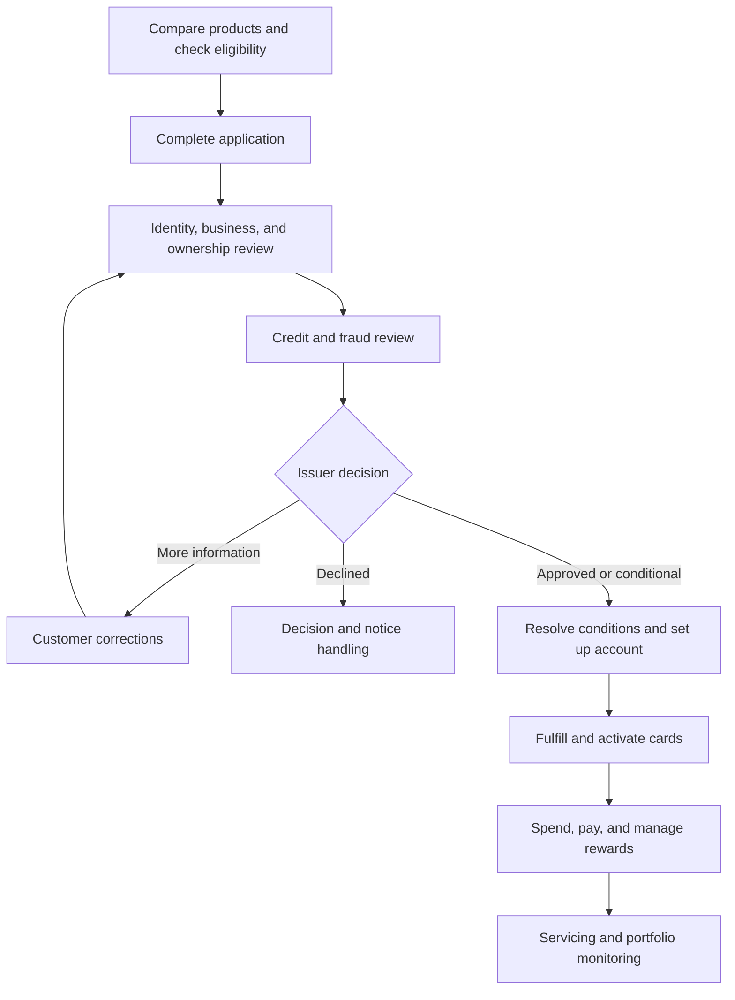

# Business Credit Cards — Detailed User Journey

I inspected the [Business Credit Cards workspace](https://www.xenhey.com/api/store/28ACF69C21E54B11AB931E1C4C2348E2), followed its customer and administrative navigation, opened a record-specific application review, and walked through all **11 application steps**.

The walkthrough covers **34 Business Credit Cards pages: 13 customer pages and 21 administrative pages**, plus the product-catalog entry. Repeated application-record links are treated as instances of the same journey.

**Pages, fields, and controls below were observed. Handoffs and completion outcomes are recommended workflow behavior unless explicitly described as verified.** I did not submit applications, execute payments, redeem rewards, or modify records.

## 1. The overall experience

The product supports three connected journeys:

| User                           | Objective                                                                                                       |
| ------------------------------ | --------------------------------------------------------------------------------------------------------------- |
| Business applicant             | Select a card, complete an application, provide evidence, and receive an issuer decision.                       |
| Business account administrator | Manage employee cards, spending controls, transactions, payments, rewards, and support.                         |
| Issuer operations team         | Verify the applicant, assess credit and fraud, record decisions, establish accounts, and service the portfolio. |

This is the recommended operating sequence supported by the available screens. Verification activities can overlap where the issuer’s process allows.

---

## 2. Discovery: Compare card products

Open the [Business Credit Cards introduction](https://www.xenhey.com/api/store/4D8DCB3864DF4F31BFF1BE5BC1E5B16C).

The prospective customer compares three product structures:

| Product            | Displayed intended use        |
| ------------------ | ----------------------------- |
| Cash Back Business | Everyday operating purchases. |
| Travel Business    | Business travel requirements. |
| Low-Rate Business  | Balance management.           |

The comparison includes annual fees, purchase APR, rewards, employee cards, and account structure. Actual pricing and terms are shown as pending issuer configuration.

### Customer walkthrough

1. Review the product descriptions.
2. Compare the intended use against business spending needs.
3. Select **Check eligibility** for preliminary intake.
4. Select **Select and apply** for the preferred product, or **Start application**.
5. Confirm the selected product in the application before continuing.

The landing page intends to carry a selected product into intake. That preselection behavior should be tested because the intake currently renders the requested-product field incorrectly, as noted later.

The [Financial Product Catalog](https://www.xenhey.com/api/store/AF1EF7DFD5754E6289D4787214A96410#catalog) is an exit to other products. Those separate product journeys are outside this Business Credit Cards walkthrough.

## 3. Preliminary eligibility

Open [Eligibility](https://www.xenhey.com/api/store/D81E900FF0EA4AB8A877F9BA3787D586).

The customer supplies:

* Entity type and industry.
* Years-in-business band.
* Annual-revenue band.
* Requested-credit-limit information.
* International-use preference.
* Contact email.

The page offers **Load representative sample**, **Save draft**, and **Save JSON record**.

**Intended outcome:** establish a preliminary business profile and identify the next review requirements. Saving this form should not be presented as an approval, credit decision, or guaranteed offer.

---

## 4. Apply for a card: All 11 steps

Open [Apply for a Card](https://www.xenhey.com/api/store/3A7AB784E3A946D998D3634C54A51675).

The application displays a completion indicator, step navigation, missing-information summary, draft controls, and a secure-document handoff.

### Step-by-step journey

| Step                            | Observed fields and customer action                                                                                                               | Intended output                                            |
| ------------------------------- | ------------------------------------------------------------------------------------------------------------------------------------------------- | ---------------------------------------------------------- |
| **1. Application**              | Select new relationship, existing customer, or additional card program. Review requested product and credit-limit fields. Select referral source. | Application context and requested offering.                |
| **2. Business**                 | Enter legal name, DBA, entity type, formation state, business age, industry, annual-revenue band, description, and contact email.                 | Business profile for verification.                         |
| **3. Business locations**       | Enter business city/state, operating-location count, and address-verification status.                                                             | Operating-footprint information and evidence requirements. |
| **4. Owners and control**       | Record owner-count band, ownership verification, control-person, signer, and identity statuses. Acknowledge secure certification.                 | Ownership and authority review requirements.               |
| **5. Financial profile**        | Select monthly-revenue, cash-balance, existing-debt, and monthly-debt-payment bands. Record financial-statement status.                           | Categorized financial information for issuer review.       |
| **6. Card request**             | Provide requested-limit information, expected monthly spending, purchase categories, international use, and cash-advance need.                    | Intended credit exposure and usage profile.                |
| **7. Existing credit**          | Select current issuer category, existing limit/balance bands, and payment-history status.                                                         | Existing-credit context.                                   |
| **8. Cardholders and controls** | Identify the primary cardholder reference, employee-card count, limits approach, merchant-category controls, geography, and transaction controls. | Proposed card program and spending policy.                 |
| **9. Documents**                | Record formation-document, financial-statement, tax-ID, and address-verification statuses. Acknowledge secure evidence submission.                | Evidence checklist for verification.                       |
| **10. Consent**                 | Review privacy, credit-review authorization, electronic delivery, possible guarantee requirements, and sensitive-data acknowledgment.             | Required acknowledgments for the issuer workflow.          |
| **11. Review and submit**       | Select Ready to submit, Needs information, or Draft. Certify categorized information and select **Submit for issuer review**.                     | Application prepared for issuer review.                    |

### Expected behavior between steps

The customer should be able to:

1. Enter information.
2. Review the missing-field summary.
3. Move backward to correct previous entries.
4. Save a draft.
5. Resume the same application later.
6. Submit only after all required steps pass validation.

I verified navigation through the steps. Draft persistence, cross-step validation on submission, and issuer submission were not tested.

### Secure-document handoff

The application provides **Open secure channel** below the wizard.

The intended journey is:

1. Identify required evidence.
2. Open the approved issuer channel.
3. Provide financial statements, formation evidence, or identity materials there.
4. Return to the application.
5. Track evidence status through Documents and Application Status.

The handoff destination and upload completion were not verified.

---

## 5. Resume an application and respond to requests

### Dashboard entry

The [Customer Dashboard](https://www.xenhey.com/api/store/28ACF69C21E54B11AB931E1C4C2348E2) includes searchable sample-record lists and links into editable intake.

A returning customer:

1. Searches for the business or application.
2. Filters by status.
3. Selects **Edit in intake** or **Open**.
4. Confirms the application reference.
5. Corrects the relevant information.
6. Saves or resubmits through the appropriate workflow.

The product exposes both `PPR-…` records and `BCC-…` applications. Their identifiers and statuses differ; they should not be assumed to represent one synchronized dataset.

### Application Status

Open [Application Status](https://www.xenhey.com/api/store/B0198B6E78974DA5A34BCB45319C82A9).

The page displays:

* Selected product and requested-limit band.
* Completion percentage.
* Current review stage.
* Last-saved time and application reference.
* Application timeline.
* Outstanding requests.
* **Continue application** and **View document requests** links.

The representative application is in credit review and requests a latest financial statement and control-person confirmation. The screen explicitly separates the pending application from an active account: available credit is not shown before activation.

### Documents

Open [Documents](https://www.xenhey.com/api/store/B89F0DB84B104D8983A528C522C51256).

The customer reviews formation, financial-statement, tax-ID, and address-verification statuses and acknowledges the secure-document process.

**Recommended correction loop:**

1. Issuer identifies a specific deficiency.
2. Customer sees the request in Application Status.
3. Customer supplies evidence through the approved channel.
4. Reviewer validates the evidence.
5. The request is cleared or returned with an explanation.
6. The application resumes review.

### Business Profile

Open [Business Profile](https://www.xenhey.com/api/store/307AFD761ED549F4B43536BEFF859141).

The page exposes legal name, DBA, entity, industry, business email/phone, and address-verification status.

A profile change should preserve history and trigger additional review where relevant. It should not silently overwrite previously verified information.

---

## 6. Issuer journey: Review and decide

### Queue and assignment

| Linked page                                                                                                                         | Observed purpose                                                                         | Reviewer action                                               |
| ----------------------------------------------------------------------------------------------------------------------------------- | ---------------------------------------------------------------------------------------- | ------------------------------------------------------------- |
| [Admin Dashboard](https://www.xenhey.com/api/store/E98BEABD2A82434BBB67F0F0E8EE308C)                                                | Pipeline overview and review/account-setup indicators.                                   | Identify workload and open the application queue.             |
| [Applications](https://www.xenhey.com/api/store/58D0BE50ED724C97A1F0A5517AB9587A)                                                   | Searchable applications with status/date filters and export.                             | Locate and open the application requiring attention.          |
| [Application Details — sample record](https://www.xenhey.com/api/store/CE867B730D9F4A5191B892F2B8D7DB45?recordId=BCC-20260915-0001) | Application reference, business, requested product/limit, assigned reviewer, and status. | Confirm the selected record and establish reviewer ownership. |

I verified that opening a queue record displayed its matching business name and application reference. Propagation of that record into every subsequent review page still needs testing.

### Verification, credit, and fraud reviews

| Linked page                                                                           | Observed review fields                                                                             | Intended handoff                                     |
| ------------------------------------------------------------------------------------- | -------------------------------------------------------------------------------------------------- | ---------------------------------------------------- |
| [Identity Review](https://www.xenhey.com/api/store/1DFA35CA41CE4F8FBD080E0CF3A957C9)  | Signer, identity-verification, sanctions-screening, identity decision, notes.                      | Resolve identity issues before approval.             |
| [Business Review](https://www.xenhey.com/api/store/E498BFD9792C4A84A38BCCAAA5AE0F4C)  | Formation, tax-ID, address, industry verification, business decision.                              | Establish a verified business profile.               |
| [Ownership Review](https://www.xenhey.com/api/store/A043074162F441FBA47AFC2C59474067) | Ownership, control person, PEP review, ownership decision.                                         | Resolve authority and ownership exceptions.          |
| [Credit Review](https://www.xenhey.com/api/store/7BC2BB1D070243838B9F24CFC372F713)    | Verified revenue, debt, requested limit, credit-bureau reference, capacity rating, recommendation. | Record an authorized credit recommendation.          |
| [Fraud Review](https://www.xenhey.com/api/store/051C1115EA674DB6A987371E79818713)     | Device, email, address risk, application velocity, fraud decision.                                 | Clear, investigate, or escalate identified concerns. |

Each review should retain the application reference, reviewer, evidence references, outcome, and rationale. A displayed screening or bureau-reference field does not prove that an external verification service has executed.

### Underwriting decision

Open [Underwriting Decision](https://www.xenhey.com/api/store/82A75E35BDCE400F8ED9F99C30AEF968).

Observed fields include:

* Application reference.
* Approved product.
* Decision.
* Approved limit.
* Pricing-configuration reference.
* Guarantee requirement.
* Conditions.
* Decision date.

**Recommended operating journey:**

1. Confirm completion of required reviews.
2. Evaluate unresolved exceptions.
3. Record the authorized decision.
4. Specify the actual approved product, limit, and terms.
5. Record any conditions and guarantee requirements.
6. Communicate the outcome through the approved process.
7. Advance approved applications to setup only when conditions permit.

Requested limits and product preferences must remain distinct from approved terms.

### Adverse-action branch

Open [Adverse Action](https://www.xenhey.com/api/store/DB1E999BCD634E0F9300FB4E2C5B91F6).

The page exposes action type, specific reasons, notice method/date, delivery status, and reviewer.

The intended journey is to document the issuer’s authorized action, prepare the appropriate notice through its approved process, and track delivery. I did not test notice generation or sending, and the page’s presence does not establish regulatory compliance.

---

## 7. Approved applicant journey: Account setup and card fulfillment

| Linked page                                                                             | Observed fields                                                                                                              | Intended outcome                                                 |
| --------------------------------------------------------------------------------------- | ---------------------------------------------------------------------------------------------------------------------------- | ---------------------------------------------------------------- |
| [Account Setup](https://www.xenhey.com/api/store/11430E43BBB4483F95210B8018426A97)      | Application/account references, masked identifier, approved limit, billing cycle, payment-due configuration, account status. | Establish the approved card account.                             |
| [Card Fulfillment](https://www.xenhey.com/api/store/E8BB82DDCB2D471794C673F2DA530F87)   | Cardholder and masked-card references, product, fulfillment status, shipping method, expected delivery.                      | Issue and deliver approved cards.                                |
| [Portfolio Controls](https://www.xenhey.com/api/store/F62C737EAE1B4532944604C9BE5E1106) | Aggregate limit, cash-advance access, merchant/geographic controls, velocity controls, alert rules.                          | Apply issuer-level account restrictions and monitoring controls. |

### Recommended activation sequence

1. Resolve approval conditions.
2. Establish the account with approved terms.
3. Configure billing and payment settings.
4. Apply account-level spending controls.
5. Fulfill primary and authorized employee cards.
6. Complete activation through the issuer’s supported process.
7. Enable the active-account dashboard.

A separate customer activation page was not discovered. Activation is therefore a required handoff to clarify, not a verified standalone screen.

---

## 8. Active-account journey: Monitor spending and manage cards

### Dashboard

The dashboard shows a representative active account with:

* Current balance and available credit.
* Pending charges.
* Statement balance, minimum payment, and due date.
* Autopay information.
* Month-to-date spending.
* Rewards available.
* Recent purchases.
* Employee spending against limits.

Displayed actions include **Make payment**, **View statement**, **Issue card**, **Spend controls**, and transaction/application-history links.

These figures are sample data, not verified account balances or issuer offers.

### Employee Cards

Open [Employee Cards / Cardholders](https://www.xenhey.com/api/store/EBE5054DED4E489BAECEC102BDC5BBB2).

The screen lists representative active, frozen, and requested cards, along with monthly limits and spending.

The request form includes:

* Primary cardholder reference.
* Employee-card count band.
* Standard, role-based, or employee-specific limits.
* Authorized-signer status.
* Transaction controls.

**User journey:**

1. Review existing cardholders.
2. Select **Issue card** or **Manage**.
3. Identify the authorized cardholder.
4. Request limits and controls.
5. Submit the card request.
6. Track issuance through the approved fulfillment process.

Issuing employee cards should not automatically increase the account’s approved aggregate limit.

### Cards and Controls

Open [Cards and Controls](https://www.xenhey.com/api/store/44A0F2373EC046389A23D1CA62A26AF1).

The page provides **Freeze card**, **Replace or report card**, and controls for:

* Cardholder limits.
* Allowed or blocked merchant categories.
* Geographic restrictions.
* Per-purchase, time, or location controls.
* International use.

**User journey:** select the correct card → review its status → request the change → receive confirmation → retain an audit record.

Card freezing, replacement, and control enforcement were not executed.

---

## 9. Transactions, payments, and rewards

### Transactions

Open [Transactions](https://www.xenhey.com/api/store/A1CCD98A885A45D7AA91A557FD58CC1E).

The screen includes spending, pending-charge, receipt, and dispute summaries. Its transaction table supports search, cardholder/status/date filters, CSV export, and **Details** actions.

Rows show date, merchant, cardholder, category, amount, posting status, and receipt status.

**Recommended user journey:**

1. Filter to the relevant cardholder and period.
2. Locate the transaction.
3. Review details and posting status.
4. Reconcile the purchase and receipt.
5. Route an unrecognized or incorrect transaction to support/disputes.
6. Track the case separately from the transaction’s posting status.

Receipt upload and dispute initiation from the Details action were not verified.

### Payments

Open [Payments](https://www.xenhey.com/api/store/7AD714263E7D400FB0F9256A857FD401).

Observed fields include payment method, amount, masked funding reference, scheduled date, payment status, and autopay status. The page offers **Review payment** and **Manage autopay**.

**User journey:**

1. Review statement balance, minimum due, and existing scheduled payments.
2. Choose the intended amount and date.
3. Select the approved funding reference.
4. Review the payment.
5. Authorize through the approved issuer system.
6. Receive confirmation and track processing.
7. Reconcile the posted payment and account balance.

The page explicitly states that payment authorization occurs through the approved issuer system. Its sample delivery estimate is not a guaranteed settlement time.

### Rewards

Open [Rewards](https://www.xenhey.com/api/store/4DF71BAB33134D35BFA355CB627F306A).

The page distinguishes available, earned, redeemed, pending, and expiring points. Its form includes program, available points, redemption type, amount, and status.

**User journey:**

1. Review available rewards separately from pending points.
2. Explore the issuer-approved redemption options.
3. Choose the redemption type and amount.
4. Review value, eligibility, and terms.
5. Authorize the redemption.
6. Track completion and updated rewards balances.

Actual redemption options, values, and processing remain issuer-dependent.

### Support

Open [Support](https://www.xenhey.com/api/store/AACABCF6BDBD424F8E7EBDB0CA26F18A).

The page captures category, priority, subject, and description, with draft and JSON-record saving.

The intended journey is to describe the issue, route it to servicing or disputes, receive a case reference, and track resolution. Ticket creation, routing, notifications, and SLA behavior were not verified.

---

## 10. Ongoing issuer operations

| Linked page                                                                                 | Observed information                                                                                          | Operational journey                                                                     |
| ------------------------------------------------------------------------------------------- | ------------------------------------------------------------------------------------------------------------- | --------------------------------------------------------------------------------------- |
| [Servicing](https://www.xenhey.com/api/store/0F1DBFBA7D92458880918DD6D81D725E)              | Request type, account, status, effective date, notes.                                                         | Receive request → validate authority → resolve or escalate → communicate outcome.       |
| [Disputes](https://www.xenhey.com/api/store/41BCAEC21E3443059338841737ADB045)               | Transaction reference, type, amount, received date, provisional-credit status, case status, resolution notes. | Link the transaction → investigate → record applicable credit treatment and resolution. |
| [Delinquency](https://www.xenhey.com/api/store/94270F737084453B9ACECF7CAA742732)            | Days past due, past-due amount, contact/workout statuses, next-action date.                                   | Review overdue account → follow authorized servicing process → track next action.       |
| [Rewards Administration](https://www.xenhey.com/api/store/9A97C27A75EC40AFBA1774B06DBF655B) | Program configuration, earning/redemption rules, adjustment amount/reason, approval.                          | Maintain program rules → review adjustments → update the approved rewards system.       |
| [Commissions](https://www.xenhey.com/api/store/334408D665F04E149A9BDEC9BD9C672F)            | Referral/application references, configuration, amount, status, payment date.                                 | Validate referral eligibility → calculate → approve → reconcile payment.                |
| [Reports](https://www.xenhey.com/api/store/6C57EC7225E74A4E8B37A33ECA515C97)                | Report type, dates, requested product, decision, risk tier.                                                   | Define reporting scope → generate approved output → investigate exceptions.             |
| [Administration](https://www.xenhey.com/api/store/4D5B268EC5BD4DBB9C5820904838934B)         | User name/email, role, account status, MFA requirement, session timeout.                                      | Request access → authorize role/security settings → audit changes.                      |
| [Audit History](https://www.xenhey.com/api/store/86DD212021D54A74801E01917DE2CCC6)          | Event type, actor, dates, record reference.                                                                   | Locate the event → inspect actor and outcome → support investigation or review.         |

These are verified screens and fields. Their save controls do not establish that external systems, report generation, access enforcement, or immutable audit logging are implemented.

---

## 11. Key alternate journeys

| Scenario                           | Customer action                                                  | Issuer action                                            | Expected result                                    |
| ---------------------------------- | ---------------------------------------------------------------- | -------------------------------------------------------- | -------------------------------------------------- |
| Missing financial statement        | Supply evidence through the approved channel.                    | Validate it and clear or refine the request.             | Resume credit review.                              |
| Ownership discrepancy              | Correct categorized information and provide secure evidence.     | Reconcile ownership/control details.                     | Continue or escalate.                              |
| Conditional approval               | Review and satisfy stated conditions.                            | Verify each condition.                                   | Proceed to permitted setup activities.             |
| Declined application               | Review the approved communication and contact support if needed. | Complete authorized decision/notice handling.            | Close the application path without provisioning.   |
| Lost or unrecognized card activity | Use card controls and report the issue.                          | Coordinate servicing, replacement, and dispute handling. | Protect the account and track resolution.          |
| Payment failure                    | Review payment status and contact support.                       | Investigate the funding/processing exception.            | Correct or reschedule through the approved system. |
| Employee departure                 | Request card restriction or closure.                             | Validate authority and process the change.               | Prevent further unauthorized use.                  |
| Rewards discrepancy                | Identify the relevant activity and raise a request.              | Review earning rules and adjustments.                    | Correct or explain the rewards outcome.            |

---

## 12. Issues that currently interrupt a clear journey

The live inspection exposed several concrete implementation concerns:

| Finding                                                                                                 | Effect on the journey                                             | Recommended correction                                                              |
| ------------------------------------------------------------------------------------------------------- | ----------------------------------------------------------------- | ----------------------------------------------------------------------------------- |
| Requested Product and Requested Credit Limit Band render as checkboxes in intake.                       | A user cannot clearly express a product or limit selection.       | Use a product selector and a defined limit-band selector.                           |
| Payment Method, Redemption Type, User Role, and several other fields use generic verification statuses. | Choices do not match the question being asked.                    | Define appropriate options for each field.                                          |
| Underwriting Decision uses Pending/Verified/Needs information/Exception/Not applicable.                 | Verification status and credit disposition are mixed together.    | Separate review completion from the authorized underwriting outcome.                |
| Dashboard contains both PPR and BCC record lists with different status models.                          | Users may not know which record controls their application.       | Establish one primary application identity and clearly label demo datasets.         |
| Application Status says “one item remains” but lists two outstanding requests.                          | Completion and next actions conflict.                             | Calculate both indicators from the same request list.                               |
| Standalone review pages show a representative application context.                                      | Navigating away from a selected record may lose its context.      | Carry and verify the application reference across all review links.                 |
| No separate customer activation screen was discovered.                                                  | Approval-to-active handoff is unclear.                            | Define the issuer activation handoff and confirmation state.                        |
| Reports and Audit History expose generic forms and save controls.                                       | Their names imply capabilities not established by the inspection. | Verify report generation and audit retrieval before demonstrating them as complete. |

A successful end-to-end demonstration should use one application from product selection through decision, preserve its identity across all pages, and clearly separate **requested terms, approved terms, account setup, card activation, and active credit availability**.
