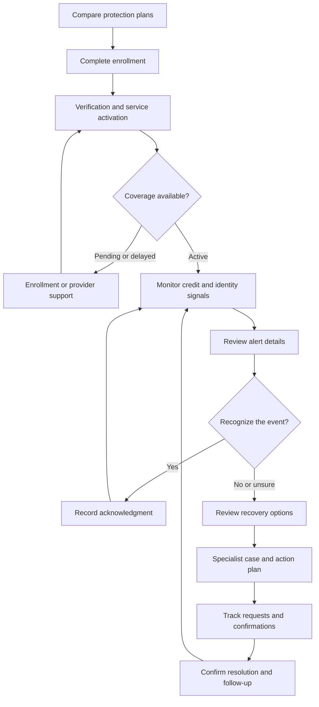

The reference opens **Credit Monitoring & Identity Protection — Protection Dashboard**. I reviewed **40 product pages: 18 member pages and 22 administrative pages**, plus the Product Catalog, and walked through all **10 enrollment sections**.

The journey below covers the linked screens, member decisions, specialist handoffs, recovery workflows, and observed gaps. The product uses sample data. **Enrollment submission, consent, alert recognition, external requests, and saved changes were not executed.** Recommended transitions are distinguished from demonstrated navigation.

**1. Overall member journey**

The member’s goal is to understand their coverage, review provider-reported changes, identify unfamiliar activity, and obtain help when needed. Operations supports enrollment, provider availability, alert triage, and recovery.

The interface makes three useful distinctions:

* **Monitoring coverage** is separate from **provider availability**.
* A **provider-reported event** is separate from the member’s **recognition decision**.
* A recovery action being **requested or submitted** is separate from its **confirmed completion**.

These distinctions should remain visible throughout the journey.

**2. Entry, plan comparison, and subscription management**

| Linked page                                                                                  | Member actions                                                                                                                                                                         | Expected outcome                                                             |
| -------------------------------------------------------------------------------------------- | -------------------------------------------------------------------------------------------------------------------------------------------------------------------------------------- | ---------------------------------------------------------------------------- |
| [Protection Dashboard](https://www.xenhey.com/api/store/19A1B3FD766E49CBB89E3CED338360CA)    | Review unreviewed alerts, enrollment requests, monitoring status, provider availability, recent activity, and recovery tasks. Select **Review alerts** or **Open recovery workspace**. | Identify the most important next action.                                     |
| [Product overview](https://www.xenhey.com/api/store/52D6DC9B188B41A89F51372247F266E4)        | Compare plans, contact support, inspect subscription controls, or choose a plan.                                                                                                       | Enter enrollment with an understanding of included services and limitations. |
| [Product Catalog](https://www.xenhey.com/api/store/AF1EF7DFD5754E6289D4787214A96410#catalog) | Return to the broader catalog.                                                                                                                                                         | Enter or leave this product journey.                                         |

The overview displays these **prototype plans and prices**:

| Plan                | Displayed monthly price | Displayed scope                                                               |
| ------------------- | ----------------------: | ----------------------------------------------------------------------------- |
| Credit Essentials   |                  $14.99 | Credit-file change alerts and score history; one configured credit source     |
| Identity Plus       |                  $24.99 | Identity, breach, and account-security signals; configured identity sources   |
| Complete Protection |                  $39.99 | Credit and identity monitoring with recovery support; all configured services |

All three describe discreet notifications, secure provider verification, and no guaranteed detection or outcome. These are displayed prototype offerings, not independently verified commercial terms.

The overview also exposes **View terms**, **Billing history**, and **Manage plan**. In the inspected behavior:

* View terms displayed “Plan terms opened.”
* Billing history displayed “Billing history opened.”
* Manage plan routes to the enrollment form.

A dedicated billing, renewal, cancellation, or plan-change experience was not demonstrated.

**3. Complete the ten-section enrollment**

The [Set Up Protection wizard](https://www.xenhey.com/api/store/3351D41350B64F31A015717F487B36D5) provides completion progress, last-saved information, missing-field summaries, section navigation, **Save and resume later**, and a final review.

| Section                    | Observed fields                                                                                                                                  | Purpose                                                    |
| -------------------------- | ------------------------------------------------------------------------------------------------------------------------------------------------ | ---------------------------------------------------------- |
| **1. Contact**             | First/last name, email, mobile number, state of residence, age eligibility                                                                       | Establish the member’s contact and eligibility information |
| **2. Protection Needs**    | Desired plan, primary concern, credit-monitoring need, identity-monitoring need, recovery-support need                                           | Match the requested service to the member’s concerns       |
| **3. Credit Monitoring**   | Bureau coverage preference, new-account alerts, inquiries, balance changes, score trends                                                         | Define requested credit-monitoring scope                   |
| **4. Identity Monitoring** | Signal categories, breach exposure, account takeover, restoration preference, scope acknowledgment                                               | Define identity-monitoring interests and limitations       |
| **5. Current Situation**   | Suspected identity theft, known exposure, unrecognized credit event, affected institution count, urgency                                         | Identify whether immediate assistance may be needed        |
| **6. Alerts**              | Email, text, push, minimum severity, quiet-hours preference, weekly summary                                                                      | Configure how the member wants to receive notifications    |
| **7. Recovery Readiness**  | Official-resource acknowledgment, institution-contact status, fraud-alert interest, freeze interest, contact preference                          | Establish the member’s recovery-support needs              |
| **8. Household Coverage**  | Household coverage, protected-consumer coverage, guardian-evidence status, dependent-data acknowledgment                                         | Identify additional authorized coverage requirements       |
| **9. Provider Enrollment** | Verification-token status, credit-file-provider token status, provider reference, delivery-test status, readiness                                | Track provider-side enrollment prerequisites               |
| **10. Consent and Review** | Monitoring authorization, privacy acknowledgment, electronic delivery, limitations, free alternatives, accuracy certification, section summaries | Review the complete enrollment before submission           |

The intended enrollment sequence is:

1. Select a plan and describe protection needs.
2. Provide contact information.
3. Configure credit, identity, and notification preferences.
4. Identify an existing concern requiring assistance.
5. Complete applicable household questions.
6. Complete secure provider verification.
7. Review the requested coverage and acknowledgments.
8. Submit and receive a stable enrollment/member reference.

The wizard explicitly says that government IDs, dates of birth, credentials, full credit reports, police reports, and recovery-document contents should not be entered into this prototype.

**Recommended behavior:** An urgent existing concern should have a clear route to recovery assistance while enrollment work continues. That automatic routing was not demonstrated.

**4. Confirm activation instead of assuming coverage**

On [Enrollment Status](https://www.xenhey.com/api/store/A54D66071C57465E8802FEFF1D03B164), the member sees separate stages:

**Consent → Secure verification → Credit monitoring → Identity monitoring → Alert delivery → Coverage ready**

The inspected sample showed:

| Component             | Displayed status   |
| --------------------- | ------------------ |
| Consent               | Accepted           |
| Secure verification   | Provider verified  |
| Credit monitoring     | Enrollment pending |
| Identity monitoring   | Enrollment pending |
| Alert delivery test   | Pending            |
| Provider availability | Delayed            |

The member can select **Continue enrollment**.

The intended journey is to identify which component is incomplete, complete the required action, and see confirmation for each activated service. Verification alone should not imply that every monitoring service is active.

**Member question:** “Which services are actually active, and what still needs attention?”

**5. Understand monitoring and credit information**

| Linked page                                                                                      | Member journey                                                                                                                                              | Expected outcome                                                       |
| ------------------------------------------------------------------------------------------------ | ----------------------------------------------------------------------------------------------------------------------------------------------------------- | ---------------------------------------------------------------------- |
| [Credit Overview](https://www.xenhey.com/api/store/9164FCA52A474C60B148F32A2FBEBCE5)             | Review the available score, source, model, update date, and nearby credit events.                                                                           | Understand what information is available and how current it is.        |
| [Score Trends](https://www.xenhey.com/api/store/FDCFEB4B861940E783C60F0EA2BDF90C)                | Inspect the displayed score history and model/source context.                                                                                               | Compare values without assuming that a nearby event caused the change. |
| [Credit-File Monitoring](https://www.xenhey.com/api/store/97593A7302234C4D966A37EAE066982E)      | Review coverage preference and new-account, inquiry, balance-change, and address-change alert settings.                                                     | Understand configured credit-event monitoring.                         |
| [Identity Monitoring](https://www.xenhey.com/api/store/4D4F77B3F3DF41B39A86CFFBC282C29F)         | Inspect service cards for email exposure, credit-file changes, account-takeover signals, and household coverage. Review masked references and update times. | Distinguish active services from pending enrollment.                   |
| [Breach Exposure](https://www.xenhey.com/api/store/A36B21F9BB7346E5ADA783B5B848A25F)             | Review provider-reported exposure records and open relevant activity.                                                                                       | Identify an exposure requiring further review.                         |
| [Account-Takeover Monitoring](https://www.xenhey.com/api/store/3EDECE008FF740D1B8F7D7ADA40162A8) | Review categorized account-security signals and their status.                                                                                               | Identify unfamiliar activity without exposing credentials.             |

The score screens expressly avoid attributing a score change to an event without provider confirmation.

The Identity Monitoring page presents each service separately. This supports partial activation, but the member needs a clear explanation when one service is active while others are pending or delayed.

**6. Review an alert and choose a response**

The [Alert Center](https://www.xenhey.com/api/store/BAC6D28EC3754F83A4095B8C7BF70FAD) provides search, date/status filters, priority, provider source, event description, and **Review** links.

The detail panel shows:

| Detail                         | Why it matters                                           |
| ------------------------------ | -------------------------------------------------------- |
| Event description              | Explains what was reported                               |
| Event date and detection time  | Distinguishes when it happened from when it was detected |
| Provider source                | Identifies the reporting source                          |
| Masked reference               | Helps the member identify the affected record            |
| Provider-confirmed information | Separates known facts from assumptions                   |
| Next step                      | Explains the requested member action                     |

The three response branches are:

| Member response            | Intended journey                                                                                                                                 |
| -------------------------- | ------------------------------------------------------------------------------------------------------------------------------------------------ |
| **I recognize this**       | Record acknowledgment and retain the event for reference. Recognition should not be presented as independent proof that the event is legitimate. |
| **I don’t recognize this** | Preserve the event context and offer specialist/recovery options.                                                                                |
| **I’m not sure**           | Explain what to check and provide assistance without forcing a definitive fraud judgment.                                                        |

The page also links to **View recovery options**.

Observed alert states are **Unreviewed, Recognized, Not recognized, Not sure, and Help requested**. Their persistence and downstream case creation were not tested.

**Member question:** “What happened, what has been confirmed, and what should I do next?”

**7. Move from an alert to a recovery plan**

The [Recovery Plan](https://www.xenhey.com/api/store/BF8FC392CA764753A402F092DF217FAE) includes:

* A case reference and case status.
* Progress percentage.
* Tasks with owners, due dates, and statuses.
* A timeline separating requested, submitted, and confirmed events.
* An assigned specialist.
* A **Secure message** control.
* A link to the official recovery resource.

The sample task sequence is:

| Task                          | Displayed owner     |
| ----------------------------- | ------------------- |
| Review unrecognized event     | Member / specialist |
| Contact affected institution  | Specialist          |
| Review appropriate next steps | Member / specialist |
| Track institution response    | Specialist          |
| Confirm outstanding actions   | Member / specialist |

The intended journey is:

1. Open recovery options from the relevant alert.
2. Request assistance with the alert/event context attached.
3. Receive a case reference and specialist assignment.
4. Review tasks, ownership, and deadlines.
5. Track each external request separately from its confirmation.
6. Provide requested evidence through the approved secure channel.
7. Confirm remaining actions before case closure.

The page explicitly states that saving a portal status does not execute an external request.

Its [IdentityTheft.gov link](https://www.identitytheft.gov/) was opened, but the destination returned no readable content in this browser. The external recovery workflow was therefore not reviewed.

**8. Track freezes, fraud alerts, disputes, and documents**

| Linked page                                                                                   | Observed fields and member actions                                                                              | Intended outcome                                         |
| --------------------------------------------------------------------------------------------- | --------------------------------------------------------------------------------------------------------------- | -------------------------------------------------------- |
| [Security-Freeze Guidance](https://www.xenhey.com/api/store/569BF77C1ED94BB390C1C94B6C9F8057) | Coverage preference, freeze status, request date, confirmation reference, temporary-lift status, acknowledgment | Track guidance and separately confirmed external actions |
| [Fraud-Alert Guidance](https://www.xenhey.com/api/store/94E3C4317AFD4550BBB373D85948DC16)     | Alert type, bureau contacted, request date, confirmation status, expiration review date                         | Track the request and follow-up                          |
| [Disputes](https://www.xenhey.com/api/store/7E502975186E4AF08CE7AE88893CBD22)                 | Dispute reference, bureau/furnisher, item category, submitted date, response due date, status                   | Keep a dispute linked to its recipient and timeline      |
| [Secure Documents](https://www.xenhey.com/api/store/C1606314ED09407DAD7F29DDFCDE73E5)         | Document reference/category, provider-vault token, received date, metadata status, review status                | Track document metadata and secure-provider references   |
| [Notification Preferences](https://www.xenhey.com/api/store/EE479DC2A0954331AF86880D899388BC) | Email/text/push, minimum severity, quiet hours, weekly summary                                                  | Keep alert delivery aligned with member preferences      |
| [Support](https://www.xenhey.com/api/store/691EE4076C4649FB9F7CD8D6B9F142C4)                  | Category, priority, subject, description                                                                        | Route enrollment, coverage, alert, or recovery questions |

These are tracking forms in the prototype. They do not demonstrate bureau submission, dispute delivery, document-vault integration, or external confirmation retrieval.

**9. Administrative journey — all linked operations pages**

Operations supports the member journey through enrollment, event handling, case management, provider monitoring, and oversight.

**Member enrollment and assignment**

| Linked page                                                                                                            | Operational activity                                                                                     | Member handoff                                   |
| ---------------------------------------------------------------------------------------------------------------------- | -------------------------------------------------------------------------------------------------------- | ------------------------------------------------ |
| [Admin Dashboard](https://www.xenhey.com/api/store/742C2A0AF8B840F589110C077B5BEFAD)                                   | Prioritize enrollment exceptions, alerts, recovery cases, provider incidents, and quality reviews.       | Direct work to the appropriate queue.            |
| [Members](https://www.xenhey.com/api/store/AE4C57B3CABC474993F2B4778519D847)                                           | Search members using stable member IDs.                                                                  | Open the correct member record.                  |
| [Member Details — sample record](https://www.xenhey.com/api/store/65CA37EC049A459EAA9B6E0F616AB51C?recordId=MBR-41000) | Review separate member, event, alert, and case IDs; assign specialists, plan, priority, and review date. | Preserve context across monitoring and recovery. |
| [Enrollment Review](https://www.xenhey.com/api/store/AC4FAE511F5B4CB4BC1E3A4B74F28F8F)                                 | Review consent, verification/provider-token statuses, plan, and decision.                                | Resolve incomplete enrollment.                   |
| [Identity Verification](https://www.xenhey.com/api/store/31EDF304AB2F4FA4907DA9B93B2D64F6)                             | Review provider reference, verification state, and manual-review requirement.                            | Confirm verification or request further action.  |
| [Monitoring Enrollment](https://www.xenhey.com/api/store/BE29DA2614374D9981F376C7BFA5B9BE)                             | Review credit/identity coverage, alert-channel status, provider enrollment, and activation decision.     | Activate and accurately display each service.    |

The inspected Member Details record correctly displayed distinct references for the member, event, alert, and case. That is a useful foundation for preserving context.

**Event intake and alert operations**

| Linked page                                                                                  | Operational activity                                                                       |
| -------------------------------------------------------------------------------------------- | ------------------------------------------------------------------------------------------ |
| [Alert Operations](https://www.xenhey.com/api/store/B86238A4746A4965BBBCFD9C5B2305D8)        | Review alert/member references, category, severity, detection date, and triage status.     |
| [Credit-File Events](https://www.xenhey.com/api/store/550E4D7619B1410EBAA2951AFC93A8CF)      | Review event/member references, category, source label, detection date, and review status. |
| [Identity Events](https://www.xenhey.com/api/store/176BEE133DC648AEA0CA42702E128C86)         | Track identity-signal category, provider source, detection date, and resolution.           |
| [Breach Monitoring](https://www.xenhey.com/api/store/2C868DE784B04E258EF132A0EF5DD39F)       | Review exposure category/date, risk level, and notification status.                        |
| [Account-Takeover Events](https://www.xenhey.com/api/store/6233B3933E2F44139FC93CCAE297A0F4) | Review service/event categories, detection date, and resolution state.                     |

The intended handoff is: provider event → validated event record → member-facing alert → recognition response → recovery assistance when needed. Automated ingestion, deduplication, and notification delivery were not demonstrated.

**Recovery and external-action assistance**

| Linked page                                                                                         | Operational activity                                                                             |
| --------------------------------------------------------------------------------------------------- | ------------------------------------------------------------------------------------------------ |
| [Case Management](https://www.xenhey.com/api/store/967D1856B3084C80AAE2D5BFC1761A8F)                | Maintain case/member references, type, severity, assigned specialist, and lifecycle status.      |
| [Recovery Assistance](https://www.xenhey.com/api/store/F4AD4ACC2F994090B3E49406EFDFF421)            | Track official-report status, affected institutions, recovery step, due date, and action status. |
| [Dispute Assistance](https://www.xenhey.com/api/store/DC78F76AA2964600A53A9EFE527D870E)             | Connect case and dispute references to the bureau/furnisher, item, submission date, and status.  |
| [Freeze and Fraud-Alert Support](https://www.xenhey.com/api/store/75BBA9C13D4B405A82DCE21576294B09) | Track assistance type, coverage, request, confirmation, and follow-up date.                      |
| [Document Review](https://www.xenhey.com/api/store/BD24BACB2E8B41E38268D13CD0177F7F)                | Review case-linked document metadata, vault reference, and review decision.                      |

Case Management exposes:

**No case → Requested → Submitted → Specialist review → Action in progress → Waiting → Confirmed complete**

These are observed options; enforcement of the transitions remains unverified.

**Provider operations, quality, and governance**

| Linked page                                                                              | Operational activity                                                                                            |
| ---------------------------------------------------------------------------------------- | --------------------------------------------------------------------------------------------------------------- |
| [Provider Operations](https://www.xenhey.com/api/store/1F367904B2BD4B79BCB88F3F5C4B3870) | Track service, integration status, last successful event, service-level status, and incidents.                  |
| [Quality Control](https://www.xenhey.com/api/store/B2830B3CD4A644EF980CD348AEAED827)     | Record case review category, sample/exception counts, decision, and notes.                                      |
| [Compliance](https://www.xenhey.com/api/store/F18C525C814D4E5188E0127A123FD69D)          | Review consent, disclosure, authorization, retention, and decision status.                                      |
| [Commissions](https://www.xenhey.com/api/store/5306F874CDCD47F09FB5302E1E37809C)         | Track referral/member references, plan, commission amount/status, and payment date.                             |
| [Administration](https://www.xenhey.com/api/store/B41A84AED86543EABCEEC24F36DEE6D8)      | Maintain user details, role, account status, MFA requirement, and session timeout.                              |
| [Audit History](https://www.xenhey.com/api/store/E9A8B6202F664B3E8595B5A0B69F4270)       | Exposes event-type, actor, dates, and record-reference fields. Detailed immutable history was not demonstrated. |

**10. Exception journeys to support**

| Trigger                                | Intended journey                                                                     | Resolution condition                                 |
| -------------------------------------- | ------------------------------------------------------------------------------------ | ---------------------------------------------------- |
| Verification incomplete                | Enrollment Status → Enrollment Review/Identity Verification → secure provider action | Provider-confirmed verification                      |
| Monitoring pending                     | Enrollment Status → Monitoring Enrollment                                            | Each purchased service has an explicit status        |
| Provider delayed                       | Dashboard → Provider Operations → incident follow-up                                 | Freshness and restored availability clearly shown    |
| Member does not recognize event        | Alert Center → Recovery Plan → Case Management                                       | Case ownership and next action established           |
| Member is unsure                       | Alert detail → explanation/support → recognition or assistance                       | Member can proceed without a forced fraud conclusion |
| Document needs information             | Secure Documents → Document Review → secure resubmission                             | Evidence accepted or a specific deficiency explained |
| External request awaiting confirmation | Guidance/dispute page → specialist follow-up                                         | Confirmation reference and date recorded             |
| Recovery task overdue                  | Recovery Plan → assigned specialist → escalation                                     | New action, owner, and due date communicated         |
| Notification delivery incomplete       | Notification Preferences → delivery test/provider review                             | Delivery confirmed through the selected channel      |
| Plan change                            | Subscription management → coverage review → consent/billing update                   | Effective date and service changes clearly confirmed |

**11. Observed gaps affecting the journey**

| Finding                                                                                                                            | Impact                                                                                         | Recommended improvement                                              |
| ---------------------------------------------------------------------------------------------------------------------------------- | ---------------------------------------------------------------------------------------------- | -------------------------------------------------------------------- |
| Terms and billing controls displayed notifications without opening content.                                                        | Members cannot inspect contractual or billing details.                                         | Provide actual documents and billing history.                        |
| Manage plan routes to enrollment.                                                                                                  | Changes, cancellation, renewal, and effective dates are unclear.                               | Add a dedicated subscription-management workflow.                    |
| Many category and preference fields use generic values such as Yes, No, Pending, and Active.                                       | Options do not describe alert types, document categories, contact preferences, or quiet hours. | Replace generic selectors with purpose-specific choices.             |
| Provider verification and activation statuses are editable in member forms.                                                        | Members may mistake self-entered status for provider confirmation.                             | Display provider-controlled results separately from member input.    |
| Enrollment lists use alert-recognition statuses.                                                                                   | Enrollment progress and alert handling become mixed.                                           | Use separate enrollment, service, alert, and case state models.      |
| Breach and account-takeover pages display member lists with mixed event types.                                                     | The affected exposure or account-security event is difficult to identify.                      | Use event-specific tables and detail views.                          |
| The dashboard says the last provider update is “today,” while service cards show September 13 and the review date is September 19. | Members may overestimate data freshness.                                                       | Derive freshness labels from the actual timestamp and timezone.      |
| The recovery case remains Requested while its timeline says a specialist accepted assignment.                                      | Current case state and recorded milestones are inconsistent.                                   | Derive the headline state from confirmed workflow events.            |
| Sample recovery tasks are due September 14, before the displayed September 16 request milestone.                                   | The timeline and deadlines are difficult to trust.                                             | Generate coherent task dates and overdue indicators.                 |
| The external recovery resource returned no readable page content in this browser.                                                  | Its downstream journey could not be verified.                                                  | Validate the handoff independently and preserve a clear return path. |

The key acceptance criterion is that **member, event, alert, case, document, and external-confirmation references remain connected**, while the interface consistently distinguishes requested coverage, active coverage, provider signals, member responses, and confirmed recovery outcomes.
