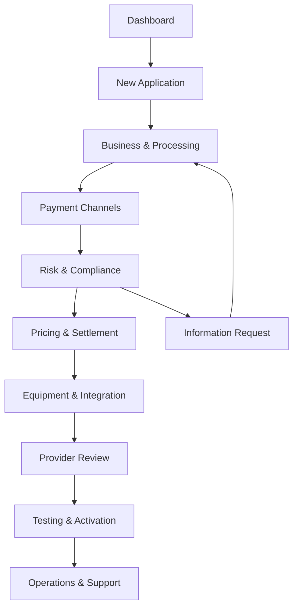
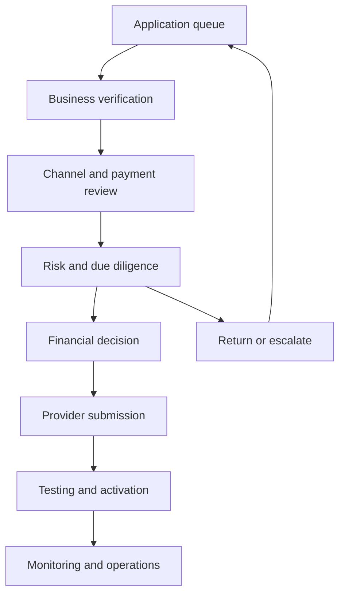

# Merchant Services—Detailed User Journey

[Merchant Services workspace](https://www.xenhey.com/api/store/57CC7857B9F24BF2A121D6C192E07BD9). The product contains two connected experiences:

* Merchant journey: application, onboarding, payment setup, compliance, pricing, equipment, activation, and ongoing support.
* Administrative journey: verification, underwriting, risk review, provider submission, testing, activation, monitoring, and operational reporting.

The environment uses synthetic data and should be treated as a prototype. Provider approval, pricing, reserves, settlement, equipment, PCI scope, and activation are not guaranteed.

## End-to-end journey

---

## Journey 1: Merchant enters the workspace

The merchant begins at the [Dashboard](https://www.xenhey.com/api/store/57CC7857B9F24BF2A121D6C192E07BD9).

### User objective

Understand the current condition of the merchant account and identify the next required action.

### Dashboard experience

The dashboard presents:

* Current application reference, such as `MS-10422`.
* Overall application completion percentage.
* Current review stage.
* Open information requests.
* Monthly processing volume.
* Awaiting settlement amount.
* Refund and chargeback indicators.
* Recent activity.
* Quick actions.
* Searchable application table.

### Available actions

The merchant can:

* Continue an incomplete application.
* Review settlement information.
* Update the processing profile.
* Resolve information requests.
* Check PCI readiness.
* Search applications.
* Filter applications by status, payment channel, or update date.
* Export application results to CSV.
* Edit or continue a selected application.
* Switch to the administrator experience.
* Open the financial-product catalog.

### Application statuses

The dashboard supports the following lifecycle:

1. Draft
2. Documents requested
3. Business verification
4. Risk review
5. Pricing review
6. Provider review
7. Conditional approval
8. Activation
9. Active
10. Declined
11. Closed

---

## Journey 2: Explore the product catalog

The merchant can open the [Financial Product Catalog](https://www.xenhey.com/api/store/AF1EF7DFD5754E6289D4787214A96410).

### User objective

Understand which financial and merchant-service products are available before starting or expanding an application.

### Expected journey

1. Open the product catalog from the global navigation.
2. Search or browse product categories.
3. Review product descriptions and preliminary eligibility guidance.
4. Compare merchant services with related financial products.
5. Select a relevant product.
6. Return to the Merchant Services workspace.
7. Start a new application or update an existing application.

The catalog is a discovery and sales-entry experience; final eligibility requires the appropriate licensed, compliance, underwriting, and provider reviews.

---

## Journey 3: Start a new application

The merchant selects [New Application](https://www.xenhey.com/api/store/8CEE790623AD42039B743EDDF99C6B9B).

The product presents a ten-step onboarding workflow with an estimated completion time of 8–12 minutes.

### Step 1: Business information

The merchant provides categorized business information:

* Legal business name
* Doing-business-as name
* Entity type
* Formation state
* Years in business
* Business description
* Business website
* Primary contact email

The user can save a draft or continue.

### Step 2: Ownership and control

The merchant describes the ownership structure without storing restricted identity information in browser storage.

The journey should capture:

* Ownership structure
* Authorized control classification
* Authorized signer status
* Beneficial-ownership completion status
* Secure-system reference for separately collected identity documentation

Exact Social Security numbers, government-ID numbers, dates of birth, signatures, and owner identity documents must remain in an approved secure system.

### Step 3: Products and services

The merchant explains:

* Products or services offered
* Industry category
* Business model
* Fulfillment method
* Restricted or regulated product exposure
* Website alignment with the declared business

This information supports industry and Merchant Category Code classification.

### Step 4: Processing volume

The merchant supplies processing estimates using categorized values:

* Expected monthly volume band
* Average transaction band
* Highest transaction band
* Seasonal-volume indicator
* Prior processing-history status
* Expected refund rate
* Expected chargeback rate

These answers feed pricing, reserve, underwriting, and risk evaluation.

### Step 5: Sales channels

The merchant identifies how customers pay:

* Card-present
* E-commerce
* Mobile
* Mail or telephone order
* Recurring billing
* ACH
* Mixed channels

Selecting a channel determines which later payment and risk forms apply.

### Step 6: Fraud and chargeback controls

The merchant records the status of:

* Address Verification Service
* 3-D Secure
* Device-risk controls
* Velocity controls
* Manual review
* Refund procedures
* Dispute handling
* Chargeback monitoring

### Step 7: PCI scope and payment technology

The merchant identifies:

* Payment environment
* Hosted versus merchant-managed payment page
* Terminal or point-of-sale usage
* Third-party payment providers
* Card-data storage status
* E-commerce script ownership
* PCI readiness status

The prototype does not independently determine SAQ eligibility. PCI scope and SAQ selection require formal review.

### Step 8: Settlement account

The merchant records categorized settlement information:

* Settlement-account readiness
* Account verification status
* Account-ownership match
* Funding preference
* Settlement-frequency preference
* Exception or hold status

Actual bank or routing numbers and bank credentials must not be stored in this browser-based prototype.

### Step 9: Equipment and integration

The merchant selects:

* Equipment type
* Quantity band
* Acquisition preference
* Installation requirement
* Training requirement
* Integration type
* Technical-support need

### Step 10: Agreements and submission

Before submission, the merchant:

1. Reviews the application summary.
2. Resolves validation errors.
3. Confirms disclosures.
4. Acknowledges that pricing and approval remain conditional.
5. Provides required attestations.
6. Submits the application.
7. Receives an application reference.
8. Moves into the verification and underwriting workflow.

The system should retain a draft between sessions and show which steps are incomplete.

---

# Merchant self-service modules

## 1. Application Progress

Open [Application Progress](https://www.xenhey.com/api/store/1665621BDE0548998596EDF9CB18FBB3).

This workspace contains three related views.

### Application Status

The merchant sees:

* Current stage
* Date the application entered the stage
* Open requests
* Document status
* Target activation date
* Application timeline
* Outstanding tasks
* PCI-readiness summary

A sample timeline is:

`Intake → Documents → Risk review → Pricing → Provider decision → Activation`

The merchant can use “Continue application” to return to the saved intake record.

### Documents

Open [Documents](https://www.xenhey.com/api/store/1E809B79DA9048D4936F689A8C530789).

The merchant reviews:

* Requested-document categories
* Request date
* Due date
* Submission-reference status
* Review status
* Rejection or resubmission reason
* Outstanding provider package items

The product should store secure-system references and review outcomes—not sensitive document contents in browser storage.

### Activation Readiness

Open [Activation Readiness](https://www.xenhey.com/api/store/5F565E3E3EA84F8AB1FDFA76D840AF1E).

The merchant confirms readiness across:

* Provider approval
* Pricing acceptance
* Agreement completion
* Settlement verification
* PCI readiness
* Equipment readiness
* Integration readiness
* Transaction testing
* Training
* Support contacts

Activation should remain blocked until all mandatory controls are complete or an authorized exception exists.

---

## 2. Business & Processing

Open [Business & Processing](https://www.xenhey.com/api/store/EF7509A918EE410BA3A5A71EBFED049E).

### Business Profile

Captures:

* Legal business name
* DBA name
* Entity type
* Formation state
* Years-in-business band
* Business description

### Processing Profile

Open [Processing Profile](https://www.xenhey.com/api/store/FB15AA8D2E34455984A4AC6C354E7EB2).

Captures:

* Monthly processing volume band
* Average transaction band
* Highest transaction band
* Processing-history category
* Seasonal-volume indicator
* Refund exposure
* Chargeback exposure

### Sales Channels

Open [Sales Channels](https://www.xenhey.com/api/store/D64695C6AD0D4720BB7124818A767653).

Captures:

* Primary payment channel
* Secondary channels
* In-person percentage
* E-commerce percentage
* Recurring-payment status
* Mail or telephone order exposure
* International-sales exposure

The merchant may save each form as a draft and revisit it after an administrator requests corrections.

---

## 3. Payment Channels

Open [Payment Channels](https://www.xenhey.com/api/store/9277CFAC85344FE088953C26CC9A412C).

### Card Present

Captures:

* Equipment type
* Card-present environment
* Contactless-payment readiness
* Fallback-process status

### E-commerce

Open [E-commerce Acceptance](https://www.xenhey.com/api/store/7CD4DD7CFD8047BD890B104295A7E23E).

Captures:

* Website and checkout status
* Hosted or merchant-controlled payment page
* Gateway status
* Authentication controls
* Fulfillment and delivery model
* E-commerce script responsibility

### Recurring Billing

Open [Recurring Billing](https://www.xenhey.com/api/store/937001E7ABF54DB384DA2CB4544CBAA1).

Captures:

* Recurring-payment model
* Customer authorization status
* Cancellation method
* Retry-management process
* Billing-descriptor status
* Subscription-disclosure status

### ACH Acceptance

Open [ACH Acceptance](https://www.xenhey.com/api/store/E9908D99A49A45C3BEE653AB76C3F5EB).

Captures:

* ACH use case
* Authorization method
* Return-risk controls
* Verification controls
* Transaction-volume band
* ACH monitoring status

---

## 4. Risk & Compliance

Open [Risk & Compliance](https://www.xenhey.com/api/store/3AEB9D0199C34A30B8D9C8CF8B72A2E0).

### Fraud Controls

The merchant records the status of:

* 3-D Secure
* Address verification
* Velocity controls
* Device-risk controls
* Manual review

### Chargeback Readiness

Open [Chargeback Readiness](https://www.xenhey.com/api/store/33AE767213E24E2D88C82CB57934DF87).

The merchant reviews:

* Refund-policy publication
* Customer-service availability
* Billing-descriptor clarity
* Dispute-response process
* Evidence-retention status
* Chargeback-monitoring readiness

### PCI Readiness

Open [PCI Readiness](https://www.xenhey.com/api/store/76A8A1CA881F4A338E6EEB7932C1A7F0).

The merchant identifies:

* Payment environment
* Payment service providers
* Card-data storage status
* PCI responsibility
* SAQ-readiness status
* Attestation status
* Service-provider evidence

The reviewer—not the prototype—confirms PCI scope and SAQ eligibility.

---

## 5. Pricing & Settlement

Open [Pricing & Settlement](https://www.xenhey.com/api/store/0009C93F845D4DF4AD1BB6ED953EA908).

### Pricing and Fees

The merchant reviews illustrative values such as:

* Pricing model
* Transaction fee
* Monthly platform fee
* Chargeback fee
* Equipment cost
* Reserve requirement
* Provider fee schedule

The merchant records acknowledgment statuses for transaction, monthly, and dispute fees.

### Settlement and Funding

Open [Settlement & Funding](https://www.xenhey.com/api/store/7A2976DEA47B41508AF6417424D381F0).

The merchant reviews:

* Settlement schedule
* Funding-speed expectation
* Weekend and holiday behavior
* Reserve status
* Funding holds
* Settlement verification
* Reconciliation preference

Actual terms remain subject to provider underwriting and agreements.

---

## 6. Equipment & Integration

Open [Equipment & Integration](https://www.xenhey.com/api/store/677BFED60C9543B5A0F250E20635DBFD).

### Equipment options

The prototype presents:

* Countertop terminal
* Wireless terminal
* Mobile reader
* Smart POS
* Virtual terminal
* Hosted checkout
* E-commerce plug-in
* Custom API integration

The merchant specifies quantity, acquisition preference, installation, and training needs.

### Integrations

Open [Integrations](https://www.xenhey.com/api/store/66C9517A52F74019A172F25D963733D2).

The merchant records:

* Integration type
* Current platform
* Gateway requirement
* API requirement
* Plug-in or hosted-checkout need
* Technical contact readiness
* Testing requirement
* Compatibility-review status

---

## 7. Operations & Support

Open [Operations & Support](https://www.xenhey.com/api/store/56E834E42F054A508E12B7841C7A4862).

### Reporting

Captures:

* Reporting need
* Reconciliation frequency
* User-count band
* Data-export need
* Operational reporting preferences

### Support

Open [Support](https://www.xenhey.com/api/store/B3D1955019FE468CB9CAF78DE47E17F3).

The merchant should be able to:

* Open a support request.
* Select a support category.
* Associate the request with an application or merchant account.
* Set business impact.
* Track case status.
* Review support responses.
* Escalate unresolved service issues.
* Close the case after resolution.

---

# Administrator journey

The operational user switches to the [Admin Dashboard](https://www.xenhey.com/api/store/11E3970EBA8F42898A090B00143BF938).

The dashboard presents:

* Monthly processing volume
* Applications in risk review
* SLA warnings
* Pending activations
* Active merchant count
* Recent operational activity
* Pipeline health
* Searchable application records

The administrator follows this sequence:

## 1. Applications

Open [Applications](https://www.xenhey.com/api/store/BF6A1773F48545F8A3B40B21D2C9A3ED).

The workspace contains:

* Applications
* Application Details
* Business Verification
* Ownership & Control
* Underwriting Profile

The reviewer selects an application, confirms completeness, assigns ownership, records verification outcomes, and chooses a decision:

* Continue
* Hold
* Return
* Escalate
* Approve
* Decline

## 2. Business & Processing review

Open [Business & Processing Review](https://www.xenhey.com/api/store/27BFD30CE9A34056B1F49F1018F8A8C6).

Review tabs include:

* Industry & MCC
* Products & Services
* Processing Volume
* Card Present
* Card Not Present

The reviewer compares declared activities with the website, processing projections, payment channels, delivery model, and provider restrictions.

## 3. Channel Risk

Open [Channel Risk](https://www.xenhey.com/api/store/0FB3AF0F9B544B4B9D6EABFEE021BE1A).

Review tabs include:

* Recurring Billing
* Future Delivery
* International
* Fraud Risk
* Chargeback Risk

Each review records control statuses, evidence references, exceptions, reviewer notes, and the disposition.

## 4. Payment Compliance

Open [Payment Compliance](https://www.xenhey.com/api/store/C44216921BA343CB98C13F57C42D4D11).

Review tabs include:

* Refund Policy
* PCI Scope
* SAQ Readiness
* E-commerce Scripts
* Payment Data Storage

The administrator validates that disclosures, payment technology, data-storage practices, and third-party responsibilities are documented appropriately.

## 5. Risk & Due Diligence

Open [Risk & Due Diligence](https://www.xenhey.com/api/store/A144DA3997AE4B608CBF72C4F403FACD).

Review tabs include:

* Third Parties
* ACH Risk
* Sanctions
* Prohibited Business
* Reputation

A failed or incomplete review sends the application back for information, places it on hold, or escalates it for specialist review.

## 6. Financial & Decision

Open [Financial & Decision](https://www.xenhey.com/api/store/4C21A8B7CE50411BA578F7F9EA900E05).

Review tabs include:

* Financial Review
* Reserve Review
* Compliance Decision
* Pricing Review
* Agreement Review

Possible outcomes include:

* Approval
* Conditional approval
* Additional reserve
* Modified pricing
* Additional documentation
* Escalation
* Decline

## 7. Provider & Activation

Open [Provider & Activation](https://www.xenhey.com/api/store/0F9413813BC04DBFAAA6C460C09CEEE4).

Review tabs include:

* Provider Submission
* Underwriting Decision
* Equipment
* Integration
* Activation

The provider response is recorded, conditions are assigned, and activation is blocked until required conditions are satisfied.

## 8. Testing & Monitoring

Open [Testing & Monitoring](https://www.xenhey.com/api/store/224E6B22515F4D8CB93B8A269FE25F85).

Review tabs include:

* Transaction Testing
* Settlement Verification
* Merchant Monitoring
* Chargebacks
* PCI Monitoring

The operations team verifies successful authorization, capture, settlement, refund, reconciliation, and monitoring behavior.

## 9. Operations

Open [Operations](https://www.xenhey.com/api/store/37568F77AF2E4E7BB5D0D46BC53E20AE).

Operational views include:

* Commissions
* Support Cases
* Reports
* Administration
* Audit History

This becomes the post-activation workspace for servicing, reporting, monitoring, compensation, administration, and auditability.

---

## Exception and rework journeys

### Missing information

1. Administrator marks one or more fields as pending.
2. Application moves to “Documents requested” or “Information requested.”
3. Merchant sees the request on the dashboard.
4. Merchant opens the affected form.
5. Merchant updates categorized information or adds a secure-system reference.
6. Administrator reopens the review.
7. The application continues or is escalated.

### Conditional approval

1. Provider or reviewer records approval conditions.
2. Merchant reviews pricing, reserve, equipment, PCI, or documentation conditions.
3. Merchant accepts or resolves the conditions.
4. Administrator verifies completion.
5. Application moves to activation.

### Decline

1. Reviewer records the decline decision and approved reason category.
2. Application status changes to “Declined.”
3. Merchant receives a controlled explanation.
4. No equipment deployment or processing activation occurs.
5. The audit history retains the decision and reviewer record.

### Post-activation monitoring

1. Merchant becomes active.
2. Transactions and settlement are monitored.
3. Refund, fraud, chargeback, PCI, and volume indicators are evaluated.
4. Threshold exceptions create operational review items.
5. Operations may request remediation, place restrictions, or escalate the merchant.
6. All decisions are written to the audit history.

---

## Critical data-handling rule

The product repeatedly warns against storing sensitive information in browser storage. The journey should store only categorized fields, review outcomes, and secure-system references.

Do not store:

* Full card numbers or track data
* Security codes or PINs
* Bank or routing numbers
* Banking credentials
* Social Security numbers
* Taxpayer or government-ID numbers
* Exact birth dates
* Exact residential addresses
* Signatures
* Owner identity details
* Uploaded-document contents

Sensitive collection should occur through an approved secure service, with only its reference and verification status displayed in this workspace.
