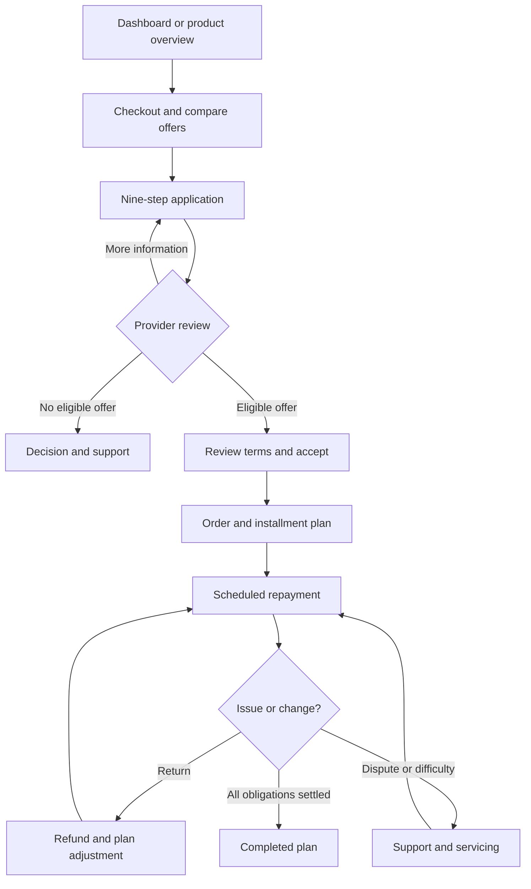

# POS Financing / BNPL — detailed user journey

The supplied link opens the **POS Financing / Buy Now, Pay Later customer dashboard**. I reviewed **35 distinct product pages: 12 customer pages and 23 operations pages**, plus the linked Product Catalog, and walked through all nine application steps.

The journey below follows the screens and links in the prototype. **Handoffs describe the intended workflow; backend processing, application submission, payment execution, and saved changes were not tested.** Repeated sample-record links are covered as record-selection paths rather than separate journeys.

## 1. Overall journey

**Customer goal:** Finance a purchase, understand the full repayment obligation, manage installments, and resolve order or payment issues.

**Operations goal:** Review the application, maintain provider-confirmed terms, connect the order to money movement, and manage servicing through completion.

The acceptance and decision branches are necessary workflow handoffs; the prototype does not fully demonstrate each transition.

## 2. Entry, discovery, and offer comparison

| Page                                                                                         | Customer actions                                                                                                                                                          | Expected outcome and next step                                                                            |
| -------------------------------------------------------------------------------------------- | ------------------------------------------------------------------------------------------------------------------------------------------------------------------------- | --------------------------------------------------------------------------------------------------------- |
| [Dashboard](https://www.xenhey.com/api/store/33B1D2FAF91843279A31CB5F7AB67A70)               | Review active plans, remaining balances, upcoming payments, returns, and applications awaiting decisions. Search records, filter by status/date, or select **View plan**. | Identify the next action: start financing, check an application, pay an installment, or resolve an issue. |
| [Product overview](https://www.xenhey.com/api/store/0CE14C5BF21740F0A5557967A3946B39)        | Read the financing explanation. Use **Explore plans**, **View my plans**, and the checkout, repayment, or returns shortcuts.                                              | Understand that eligibility, cost, dates, and available controls depend on the provider’s offer.          |
| [Product Catalog](https://www.xenhey.com/api/store/AF1EF7DFD5754E6289D4787214A96410#catalog) | Return to the broader catalog and locate POS Financing / BNPL.                                                                                                            | Enter or leave this product journey. Other catalog products are outside this walkthrough.                 |
| [Checkout](https://www.xenhey.com/api/store/C2104C7EB5684757A05905F3C820A8B9)                | Confirm merchant, order reference, purchase amount, tax/shipping, and total. Compare offers and choose **Select plan**.                                                   | Open the financing application with the record and selected plan identified in the URL.                   |

### Checkout example observed

The sample checkout shows Harbor Home Goods, order **ORD-058210**, with a **$279.35 purchase total**.

| Displayed offer      | Due today | Displayed installment |    APR |   Fees | Total payable |
| -------------------- | --------: | --------------------: | -----: | -----: | ------------: |
| Pay in 4             |    $69.84 |                $69.84 |  0.00% |  $0.00 |       $279.35 |
| 6-payment financing  |    $47.72 |                $47.72 |  9.99% |  $0.00 |       $286.33 |
| 12-payment financing |    $26.02 |                $26.02 | 14.99% | $12.00 |       $312.29 |

These are **illustrative prototype offers**, displayed as payments every two weeks and expiring with the checkout session. The journey should carry the selected offer’s exact amounts, dates, fees, and terms into the application and final acceptance.

**Customer question at this stage:** “What will I pay today, what will I pay later, and what is the total cost?”

## 3. Complete the nine-step application

The [Financing Application](https://www.xenhey.com/api/store/8A4028852BAF478AB607DC530832B9AE) includes step navigation, completion progress, last-saved information, missing-field summaries, **Previous**, **Continue**, **Load sample**, and **Save and exit**.

| Step                     | Observed information and controls                                                                                                                | Journey purpose                                                              |
| ------------------------ | ------------------------------------------------------------------------------------------------------------------------------------------------ | ---------------------------------------------------------------------------- |
| **1. Purchase**          | Merchant, order reference, product description/category, purchase amount, tax, shipping, and order total.                                        | Tie financing to the correct purchase and reconcile the total with checkout. |
| **2. Applicant**         | Full name, email, mobile number, city, state, and residence status.                                                                              | Establish the applicant’s contact and residence information.                 |
| **3. Income**            | Employment status, annual income band, and income verification status.                                                                           | Collect categorized income information for review.                           |
| **4. Obligations**       | Monthly housing payment band, monthly debt payment band, active installment-plan band, and affordability review status.                          | Provide context for the provider’s affordability assessment.                 |
| **5. Payment method**    | Payment-method reference, masked payment method, and payment authorization acknowledgment.                                                       | Associate a securely stored payment method with the application.             |
| **6. Plan request**      | Requested term of 4, 6, or 12 installments; offered plan; installment amount; APR disclosure; fees; total payable.                               | Review the requested financing structure and returned offer.                 |
| **7. Verification**      | Identity verification, income verification, and affordability review statuses.                                                                   | Show whether required reviews are complete or further information is needed. |
| **8. Disclosures**       | Lending disclosure, plan terms, privacy notice, disclosure/terms versions, and acknowledgments for disclosure, privacy, and electronic delivery. | Present the applicable documents and collect the relevant acknowledgments.   |
| **9. Review and submit** | Section summaries, **Edit** controls, accuracy certification, and **Submit application**.                                                        | Correct errors and deliberately submit the completed application.            |

### Intended application experience

1. Purchase and selected-offer information carries forward from checkout.
2. The applicant supplies missing information.
3. Each step explains what remains incomplete.
4. **Save and exit** provides a reliable way to resume.
5. Review shows the purchase, requested plan, cost, payment method, and disclosures together.
6. Submission produces an application reference and a clear next action.

**Observed limitation:** Review statuses and several offer fields are editable in the customer form. In a finished journey, provider decisions and confirmed offer terms should be clearly distinguished from information the applicant supplies.

## 4. Track the application and receive a decision

On [Application Status](https://www.xenhey.com/api/store/051F501783514B1A887CBBDB1BCF6610), the customer sees the application reference, merchant/order, requested amount, and current progress.

The sample displays **Application pending**, **Provider review**, and **Pre-acceptance**, with a warning that final terms appear in the provider-returned offer before acceptance.

| Situation               | Customer journey                                                                                             | Operations handoff                                                                                             |
| ----------------------- | ------------------------------------------------------------------------------------------------------------ | -------------------------------------------------------------------------------------------------------------- |
| Application pending     | Check progress without treating the request as accepted financing.                                           | Complete identity, affordability, fraud, and underwriting reviews.                                             |
| More information needed | Receive a specific request, return to the relevant application section, and provide the missing information. | Reassess the updated record. This notification/resubmission loop needs validation.                             |
| Offer available         | Review final amounts, dates, APR, fees, and terms before accepting.                                          | Maintain the exact offer and disclosure versions.                                                              |
| No eligible offer       | Receive a clear decision and support route.                                                                  | Use the adverse-action workflow where applicable. A complete customer decline experience was not demonstrated. |
| Accepted financing      | Receive confirmation linking application, offer, order, and installment plan.                                | Confirm authorization and downstream records. A distinct final acceptance screen was not observed.             |

**Customer question:** “Am I still applying, do I have an offer, or do I already have a repayment obligation?”

## 5. Manage the purchase and repayment

| Page                                                                                   | Detailed customer journey                                                                                                                                               | Expected outcome                                                                                                    |
| -------------------------------------------------------------------------------------- | ----------------------------------------------------------------------------------------------------------------------------------------------------------------------- | ------------------------------------------------------------------------------------------------------------------- |
| [Orders](https://www.xenhey.com/api/store/4C0513240BB749B3A799B6CF7E518B9D)            | Locate the order; inspect merchant, description, total, order status, and delivery date. Displayed order statuses include Authorized, Captured, Shipped, and Delivered. | Understand purchase fulfillment separately from financing status.                                                   |
| [Installment Plans](https://www.xenhey.com/api/store/E143D1E725114AF497293276905677A8) | Open a plan from the dashboard. Review remaining balance, next due date, masked payment method, autopay, and installment schedule.                                      | Know what is due and when.                                                                                          |
| [Payments](https://www.xenhey.com/api/store/3DA77CF470D94C2D98B5B9C04680865A)          | Confirm plan and amount, select a stored method and available date, review authorization/notices, and use **Review payment**.                                           | Reach a reviewed payment instruction and, after confirmation, a payment reference. Actual execution was not tested. |
| [Profile](https://www.xenhey.com/api/store/5E9C27ACF3E34520AA62A40D0FCA8615)           | Review name, email, mobile number, city, state, and communication preference.                                                                                           | Keep servicing contact information current.                                                                         |

The installment-plan page provides three important routes:

* **Make a payment** → Payments.
* **Manage payment method** → Payments.
* **Get help** → Support.

The Payments page explicitly tells customers to check scheduled payments before submitting another. Its guidance calls for comparing plan, amount, method, and date to avoid duplicates. Early payment and rescheduling are described as provider-dependent.

**Recommended completion condition:** Show a plan as completed only after the remaining obligation is settled and no relevant payment or adjustment remains unresolved.

## 6. Handle returns, disputes, and support

### Return and refund journey

The [Refunds page](https://www.xenhey.com/api/store/591F0B2AE7224FE6AC9CCF0EFFF6F5CD) separates three processes:

| Process         | Observed statuses                                                    | Customer meaning                                            |
| --------------- | -------------------------------------------------------------------- | ----------------------------------------------------------- |
| Merchant return | Not requested, Return reported, Merchant review, Accepted, Completed | The merchant is handling the returned purchase.             |
| Refund          | Not requested, Pending, Processing, Confirmed, Completed             | The refund has its own processing state.                    |
| Plan adjustment | Not required, Pending, Calculated, Applied                           | The financing balance and schedule may still need updating. |

The customer journey is:

1. Identify the order and return reference.
2. Record the return reason and requested refund amount.
3. Track merchant review.
4. Track refund confirmation.
5. Wait for the provider-confirmed plan adjustment.
6. Follow **View payment schedule** to inspect the resulting obligation.

The prototype expressly states that **a merchant return does not automatically pause installments**. The page shows the current payment obligation while an adjustment is pending.

### Dispute journey

On [Disputes](https://www.xenhey.com/api/store/917E6959D9A24E278F66A1F85BF669E3), the form includes transaction reference, dispute type, disputed amount, reason, received date, and review status.

The intended journey is to identify the disputed transaction, explain the issue, receive a case reference, and track the outcome. The customer should be told separately whether the dispute changes any scheduled obligation; the prototype does not demonstrate that full case lifecycle.

### Support journey

On [Support](https://www.xenhey.com/api/store/759D8F2548314F02B089F94115E65C0D), the customer provides a plan reference, priority, subject, and description.

Support should preserve the originating plan or order context and route the issue to servicing, refunds, disputes, or payment assistance. Ticket assignment, response timing, and customer notifications were not demonstrated.

## 7. Operations journey — all linked workspaces

The product exposes a **Financing Operations** workspace alongside the customer flow. The sequence below describes how its pages support the customer journey; the presence of a page does not establish that the handoff is automated.

### Merchant readiness

| Linked page                                                                               | Operational activity                                                                                    | Customer impact                                     |
| ----------------------------------------------------------------------------------------- | ------------------------------------------------------------------------------------------------------- | --------------------------------------------------- |
| [Merchants](https://www.xenhey.com/api/store/175B0241D1A24D8789922856A9F0AFD7)            | Maintain merchant name/ID, industry, integration status, settlement configuration, and support contact. | Establish the merchant context for checkout.        |
| [Merchant Integration](https://www.xenhey.com/api/store/BCB427A144F74669935CBA515A2B43AC) | Review integration status, settlement configuration, and readiness.                                     | Support reliable order and financing handoffs.      |
| [Disclosures](https://www.xenhey.com/api/store/D557A3C193524B7AB027C5D170F2A8F9)          | Maintain terms version, disclosure version, state, and review status.                                   | Associate the appropriate documents with the offer. |

### Application review and decision

| Linked page                                                                                | Operational activity                                                                                  | Expected handoff                                                                             |
| ------------------------------------------------------------------------------------------ | ----------------------------------------------------------------------------------------------------- | -------------------------------------------------------------------------------------------- |
| [Admin Dashboard](https://www.xenhey.com/api/store/FD9863A08E034ABD87AB3BCA0E444981)       | Monitor applications, authorizations, refunds, settlement exceptions, and money totals.               | Prioritize work requiring attention.                                                         |
| [Applications](https://www.xenhey.com/api/store/C8879688A432425E8BCD6C12EEC50695)          | Search/filter the queue and open a record.                                                            | Enter the selected application’s workspace.                                                  |
| [Application Details](https://www.xenhey.com/api/store/B44BA6CC0CCD4FD7BEE9FFDE94744B91)   | Review application ID, status, notes, and connected records.                                          | Coordinate specialist reviews.                                                               |
| [Identity Review](https://www.xenhey.com/api/store/F12557D8BEDF4E28A8CB342A949EC080)       | Inspect identity verification status and record review notes.                                         | Confirm completion or request further information.                                           |
| [Affordability Review](https://www.xenhey.com/api/store/558D7142E13E48B28F9A08D234C95FBB)  | Review income verification, housing/debt bands, and active installment plans.                         | Provide an affordability assessment for decisioning.                                         |
| [Fraud Review](https://www.xenhey.com/api/store/2BB46F0EBAF2432DACA92236AE81BE46)          | Review application and transaction status with notes.                                                 | Resolve concerns before progression.                                                         |
| [Underwriting Decision](https://www.xenhey.com/api/store/1FAF9D3C6D014573B9A10E7E81E197A0) | Record review outcome, offered plan, installment amount, APR, fees, total payable, and terms version. | Return the provider-confirmed offer or decision.                                             |
| [Adverse Action](https://www.xenhey.com/api/store/DCEDF0FB0ECD4972A31F5EF9DB812442)        | Record application reference, review status, reason field, and received date.                         | Support an unsuccessful-application outcome; notice generation/delivery is not demonstrated. |

Opening a record-specific application link did load the selected shopper, application, order, and plan references. That establishes a visible record-context handoff, although propagation through every subsequent workspace remains unverified.

### Authorization and money movement

| Linked page                                                                         | Operational activity                                                                                | Expected result                                                   |
| ----------------------------------------------------------------------------------- | --------------------------------------------------------------------------------------------------- | ----------------------------------------------------------------- |
| [Authorizations](https://www.xenhey.com/api/store/D1B3321829014C70B042E27F11D72CBD) | Review application, merchant, order total, authorization status, provider reference, and timestamp. | Identify whether authorization is approved, pending, or reversed. |
| [Transactions](https://www.xenhey.com/api/store/505A45C8CB7D4A20BEEA194F71E13629)   | Connect transaction and plan references, type, amount, date, and status.                            | Track posted, pending, or reconciled money events.                |
| [Settlements](https://www.xenhey.com/api/store/382785D278934F4E997C2071FBAB1649)    | Reconcile merchant batch, gross amount, refunds, fees, net amount, status, and date.                | Resolve merchant settlement or identify exceptions.               |
| [Commissions](https://www.xenhey.com/api/store/E0CD0D0AC2EB42FDBE3020990EA3187E)    | Review merchant, settlement batch, fee amount, and settlement status.                               | Connect commission/fee records to settlement activity.            |

### Servicing and exception handling

| Linked page                                                                                 | Operational activity                                                      | Customer handoff                                                              |
| ------------------------------------------------------------------------------------------- | ------------------------------------------------------------------------- | ----------------------------------------------------------------------------- |
| [Servicing](https://www.xenhey.com/api/store/65E79D8612E24D21B69036409D562201)              | Maintain plan status, next payment, due date, autopay status, and notes.  | Keep the customer’s plan information aligned with confirmed servicing events. |
| [Refund Administration](https://www.xenhey.com/api/store/DDC4A3E92EC44385939F5CC0E9642442)  | Review return state, requested amount, refund state, and plan adjustment. | Publish the confirmed revised obligation.                                     |
| [Dispute Administration](https://www.xenhey.com/api/store/6478AAD6134D4B9D9204C5C9B8B680BA) | Review disputed transaction, type, amount, status, and notes.             | Communicate the resolution and any resulting adjustment.                      |
| [Collections](https://www.xenhey.com/api/store/CAF3B10F592A4B6B94675F9CF83F3008)            | Review balance, due date, status, and collections notes.                  | Coordinate overdue-account handling with servicing.                           |

### Oversight and administration

| Linked page                                                                         | Observed purpose                                                                                                      |
| ----------------------------------------------------------------------------------- | --------------------------------------------------------------------------------------------------------------------- |
| [Compliance](https://www.xenhey.com/api/store/AB88CB3F5FB24056BAEE3C37DB887EFA)     | Application-level review of disclosure/terms versions, status, and notes.                                             |
| [Reports](https://www.xenhey.com/api/store/D8828FFF209641B09AF59CDA39F4E073)        | Form for report type, dates, merchant, and review status. Report generation was not demonstrated.                     |
| [Administration](https://www.xenhey.com/api/store/144A9301488F4CA19A85EA2E7A0F578E) | User name/email, role, review status, and MFA-required field. Access enforcement was not tested.                      |
| [Audit History](https://www.xenhey.com/api/store/E2F3227A1EFD448187100143F063199A)  | Form for transaction type, person, dates, and sample-record ID. An immutable event-history view was not demonstrated. |

## 8. Prototype gaps affecting the journey

| Observed issue                                                                                                                                | Journey impact                                                                         | Recommended correction                                                                 |
| --------------------------------------------------------------------------------------------------------------------------------------------- | -------------------------------------------------------------------------------------- | -------------------------------------------------------------------------------------- |
| Selecting the **six-payment offer** opened the matching application, but its plan section still showed **four installments**.                 | The customer may review a different plan from the one selected.                        | Preserve the selected offer ID and populate its exact terms consistently.              |
| Checkout showed **$279.35**, while the related sample plan showed **$291.35 remaining** and four **$72.84** installments.                     | Cost and repayment cannot be reconciled confidently across screens.                    | Use a consistent provider-confirmed record and explicitly handle installment rounding. |
| A sample marked **Application pending** already displayed a repayment schedule and enabled autopay.                                           | Application, acceptance, and active-plan states become ambiguous.                      | Gate repayment presentation and actions by the confirmed lifecycle state.              |
| Payment-method, dispute-type, support-priority, report-type, and user-role selectors contain generic values such as “Pending” and “Verified.” | Users cannot select meaningful values for the task.                                    | Replace generic options with appropriate domain values.                                |
| Several table filters visibly include HTML status-badge markup.                                                                               | Status filtering is confusing.                                                         | Display plain-language status labels.                                                  |
| Lending disclosure, plan terms, and privacy links point to the same `#terms` anchor; no separate document content was demonstrated.           | The customer cannot clearly inspect each referenced document.                          | Provide readable, versioned documents and working destinations.                        |
| Loading the sample application showed acknowledgments and certification already checked.                                                      | Demonstrations can imply that the customer has already consented.                      | Keep explicit customer acknowledgments separate from sample data.                      |
| Many customer and operations pages offer **Save JSON record** or similar prototype controls.                                                  | Record editing is presented where customers expect service outcomes and confirmations. | Replace these with task-specific actions, references, and status feedback.             |
| Generic business intake records appear above the BNPL dashboard.                                                                              | They obscure the shopper’s next payment and plan tasks.                                | Keep sample-data management separate from the customer’s operational view.             |

The key design requirement is a continuous, understandable record chain: **purchase → application → confirmed offer → acceptance → order authorization → installment plan → payments → adjustments → completion**, with every customer page showing the same confirmed amounts and state.
