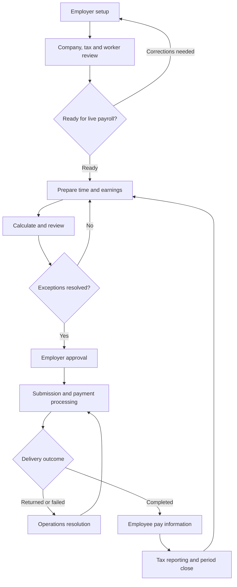

The reference opens **Payroll Services — Employer Dashboard**. I reviewed **37 linked product pages: 15 employer/employee pages and 22 administrative pages**, plus the Product Catalog, and walked through all **11 onboarding steps**.

Below is a detailed journey covering those links, the recurring payroll cycle, employee self-service, and operational exceptions. The screens use synthetic data. Submission, approval, payment execution, tax filing, and saved changes were not tested; proposed handoffs are identified as intended behavior.

**1. Overall user journey**

The primary employer journey is to establish the company, configure payroll, prepare employee earnings, resolve exceptions, approve payroll, and track payment completion. Employees then access their pay information, while operations manages funding, taxes, corrections, and period-end processing.

The major users and responsibilities are:

| User                           | Main responsibility                               | Successful outcome                                               |
| ------------------------------ | ------------------------------------------------- | ---------------------------------------------------------------- |
| Employer/payroll administrator | Configure the company and prepare payroll         | Accurate payroll ready for approval before cutoff                |
| Manager/time approver          | Review hours, overtime, and leave                 | Approved time available for payroll                              |
| Authorized payroll approver    | Review calculations and funding                   | Explicit approval of the correct calculation                     |
| Employee                       | Review pay information and request changes        | Understand pay and maintain accurate contact/payment information |
| Payroll operations specialist  | Implement, process, and resolve exceptions        | Payroll progresses to confirmed completion                       |
| Tax specialist                 | Manage deposits, filings, notices, and amendments | Obligations and corrections tracked with confirmation            |
| System administrator           | Manage users and oversight                        | Appropriate access and traceable activity                        |

**2. Enter the product and identify the next action**

| Linked page                                                                                    | User actions                                                                                                                                                                                                                    | Journey outcome                                                                                   |
| ---------------------------------------------------------------------------------------------- | ------------------------------------------------------------------------------------------------------------------------------------------------------------------------------------------------------------------------------- | ------------------------------------------------------------------------------------------------- |
| [Employer Dashboard](https://www.xenhey.com/api/store/8A08E2B8FA0D4B3A89D44F27CF7441DC)        | Review the next pay period, payday, submission cutoff, payroll status, projected funding, approved time, and exceptions. Select **Continue payroll**, **Run payroll**, **Add employee**, **Approve time**, or **View reports**. | Identify the next task and its deadline.                                                          |
| [Payroll Services overview](https://www.xenhey.com/api/store/0D97F5ADD0F3438BB1557635E1D3D1D4) | Read the service overview and open setup, workforce/time, calculation/approval, or tax operations.                                                                                                                              | Understand the workflow and enter the relevant workspace.                                         |
| [Product Catalog](https://www.xenhey.com/api/store/AF1EF7DFD5754E6289D4787214A96410#catalog)   | Return to the broader financial-product catalog.                                                                                                                                                                                | Enter or leave the Payroll Services product. Other catalog products are outside this walkthrough. |

The dashboard also provides search, status/date filters, CSV export, and record-specific **Open** links.

The employer navigation is organized into four groups:

* **Setup & Onboarding:** Eligibility, Set Up Payroll, Onboarding Status, Company Profile.
* **Workforce & Time:** Employees, Time & Attendance, Employee Self-Service.
* **Payroll Processing:** Run Payroll, Payroll Approval, Direct Deposit.
* **Taxes & Support:** Tax Setup, Reports, Support.

The tabs within each group are separate linked pages, so the sidebar alone does not reveal the complete journey.

**3. Determine eligibility and begin onboarding**

On [Eligibility](https://www.xenhey.com/api/store/8054DCBDCBEA4EDF8D471FE9486288D4), the employer provides:

| Information            | Purpose                                                  |
| ---------------------- | -------------------------------------------------------- |
| Business country       | Establish the operating country                          |
| Work states            | Identify relevant payroll jurisdictions                  |
| Employee count         | Describe workforce size                                  |
| Pay frequency          | Select weekly, biweekly, semimonthly, or monthly payroll |
| Desired first pay date | Establish the implementation target                      |
| Contact email          | Identify the onboarding contact                          |

The intended handoff is to confirm service availability and whether the requested first payroll date is achievable, then continue to setup. The prototype exposes the intake fields but does not demonstrate an eligibility decision or automatic routing.

**Employer question:** “Can this service support my workforce, locations, and first payday?”

**4. Complete the 11-step payroll setup**

The [Set Up Payroll wizard](https://www.xenhey.com/api/store/DD4AC7FFFDBE4C45980FE5ED0B1B9123) provides completion progress, last-saved information, missing-field summaries, step navigation, **Previous**, **Continue**, **Save and exit**, and final review.

| Step                          | Observed fields and controls                                                                                                         | Purpose and expected handoff                                   |
| ----------------------------- | ------------------------------------------------------------------------------------------------------------------------------------ | -------------------------------------------------------------- |
| **1. Company information**    | Legal company name, DBA, entity type, primary contact name/email                                                                     | Establish the employer record for company verification         |
| **2. Jurisdictions**          | Work states, work locations, tax registration, state registration, unemployment registration statuses                                | Establish the jurisdictions and registrations requiring review |
| **3. Payroll schedule**       | Pay frequency, desired first pay date, timezone, submission cutoff                                                                   | Define the recurring schedule and preparation deadline         |
| **4. Workers**                | Employee count, worker import status, employee reference, classification, employment status                                          | Establish the workforce and identify import errors             |
| **5. Earnings**               | Pay type, earnings configuration status, regular pay, overtime pay, additional earnings                                              | Configure the inputs used to calculate earnings                |
| **6. Deductions**             | Deduction configuration status and deductions                                                                                        | Establish applicable deductions                                |
| **7. Benefits**               | Benefit configuration status and employer contributions                                                                              | Include benefit-related employer costs                         |
| **8. Payments**               | Masked funding source, funding verification, payment-provider token status, authorization acknowledgment                             | Connect payroll to verified funding arrangements               |
| **9. Prior balances**         | Prior-balance import status and previous gross pay                                                                                   | Support migration from an existing payroll process             |
| **10. Documents and testing** | Document status, parallel-test status, go-live readiness, electronic-signature evidence status                                       | Confirm supporting setup and testing readiness                 |
| **11. Review and authorize**  | Authorization status, approval acknowledgment, tax-responsibility acknowledgment, accuracy certification, editable section summaries | Review the complete setup before **Submit onboarding**         |

The wizard describes worker and prior-balance import previews with validated rows and row-level errors. Full upload, validation, and correction behavior was not demonstrated.

The page also states that full bank details, employee SSNs, tax credentials, document contents, and signature evidence belong in secure integrations. The prototype collects references and statuses for those processes.

**Recommended completion condition:** Onboarding should become ready only when required company, jurisdiction, worker, funding, authorization, and testing requirements have been satisfied.

**5. Track implementation and maintain company information**

| Linked page                                                                            | User journey                                                                                                                                                                                | Expected result                                             |
| -------------------------------------------------------------------------------------- | ------------------------------------------------------------------------------------------------------------------------------------------------------------------------------------------- | ----------------------------------------------------------- |
| [Onboarding Status](https://www.xenhey.com/api/store/665EE93156284B9AA737C2DAF117AB49) | Review Company Setup → Workers → Tax Setup → Parallel Test → Approval → Live Payroll. Inspect setup stage, test status, readiness, and next action. Use **Continue setup** for corrections. | Understand what prevents go-live and who must act next      |
| [Company Profile](https://www.xenhey.com/api/store/55927C9CED75429A8B4FFB7C05B10295)   | Review legal name, DBA, entity type, work states/locations, and primary contact email.                                                                                                      | Maintain the employer’s operating information               |
| [Tax Setup](https://www.xenhey.com/api/store/3B51FC89F5FB47EC9B07BEA0BD82C9D5)         | Review work states and tax, state, and unemployment registration statuses; acknowledge tax responsibility.                                                                                  | Give operations the registration context needed for payroll |

The intended correction loop is: operations identifies a missing item → employer receives an actionable request → employer updates the relevant section → operations rechecks readiness. Notifications and automatic status synchronization remain unverified.

**6. Establish the workforce and approve time**

On [Employees](https://www.xenhey.com/api/store/C6AF6362AA8043DEA8EAC928AC9373D3), the employer sees a worker-specific directory with employee ID, name, department, classification, pay type, setup status, and **Edit** links.

The page offers **Import employees** and **Add employee**, plus an employee setup form containing name/reference, department, employee/contractor classification, employment status, pay type, hourly rate, and salary pay.

The intended journey is:

1. Add or import workers.
2. Review validated records and row errors.
3. Correct worker-specific details.
4. Confirm employment status and pay configuration.
5. Make approved records available to payroll preparation.

On [Time & Attendance](https://www.xenhey.com/api/store/165A5A20605845E1AFBE8B47DED2A33C), the manager or payroll administrator:

1. Reviews counts for approved timecards, overtime review, and missing approvals.
2. Searches or filters employees requiring action.
3. Opens a worker’s **Review** link.
4. Checks regular hours, overtime, paid leave, time approval, and manager approval.
5. Returns incorrect entries for correction or completes the review.
6. Makes approved time available for the payroll run.

The observed manager approval values are **Pending, Approved, and Returned**. Time review distinguishes **Ready, Review overtime, and Missing time approval**.

**Employer question:** “Are all workers and hours correct before I calculate payroll?”

**7. Prepare, calculate, and review payroll**

The [Run Payroll page](https://www.xenhey.com/api/store/625C9A974AFB47E0B9745AFF44882EA3) displays the company, pay period, payday, and an employee earnings grid.

The preparation journey is:

1. Confirm the company and payroll period.
2. Use **Import approved time**.
3. Review regular hours, overtime, bonuses, reimbursements, and worker review statuses.
4. Resolve missing approvals or overtime questions.
5. Compare against the previous run.
6. Save the draft when more work is needed.
7. Select **Calculate and preview**.

The preview link carries the selected record into [Payroll Approval](https://www.xenhey.com/api/store/EC91073B91A142D095CEAB5844FE1FBF). I verified that the sample payroll reference and company were retained.

The approval screen presents:

| Review area      | Displayed information                                    |
| ---------------- | -------------------------------------------------------- |
| Payroll identity | Payroll reference, company, payday, status               |
| Employee amounts | Gross wages, employee taxes, deductions, net pay         |
| Employer costs   | Employer taxes, contributions, service fees              |
| Funding          | Required funding, masked funding source, scheduled debit |
| Delivery         | Direct-deposit and check totals                          |
| Change review    | Previous-run change                                      |
| Exceptions       | Exception description, severity, and owner               |
| Decision         | **Return for correction** or **Approve payroll**         |

The page explicitly says that changes after approval require review of the updated calculation. It also distinguishes approval from employee payment.

**Intended approval behavior:** Bind approval to a specific calculation version. If hours, earnings, deductions, funding, or dates change materially, return the payroll for review before submission.

**8. Verify funding and track payment completion**

On [Direct Deposit](https://www.xenhey.com/api/store/F9CFF22C39484E3487AB5F15E6908BA9), the employer reviews employee references, masked deposit references, payment-provider token status, and funding verification status.

The intended payment journey is:

1. Confirm the approved payroll and verified funding source.
2. Confirm employee payment arrangements.
3. Submit within the configured cutoff.
4. Track processing.
5. Resolve returned or unsuccessful delivery.
6. Mark completion only after confirmation.

The product exposes these payroll statuses:

| Status            | Meaning in the intended journey                  |
| ----------------- | ------------------------------------------------ |
| Draft             | Payroll is being prepared                        |
| Time review       | Time information needs review                    |
| Exceptions        | Issues require resolution                        |
| Awaiting approval | Calculation is ready for the authorized approver |
| Approved          | Approval has been recorded                       |
| Submitted         | Payroll has entered the processing workflow      |
| Processing        | Processing is underway                           |
| Completed         | Completion has been confirmed                    |

These are observed status options, not proof that every transition is enforced. A separate final submission and payment-confirmation flow was not exercised.

**9. Employee self-service, reports, and support**

| Linked page                                                                                | User journey                                                                                                                                                       | Expected outcome                                                     |
| ------------------------------------------------------------------------------------------ | ------------------------------------------------------------------------------------------------------------------------------------------------------------------ | -------------------------------------------------------------------- |
| [Employee Self-Service](https://www.xenhey.com/api/store/AEC9EC0CE898413D8E654E22142D88BE) | Review latest net pay, YTD earnings, payslip/tax-document availability, masked deposit reference, and pay-period history. Submit a contact/payment change request. | Understand pay and request changes with the correct employee context |
| [Payroll Reports](https://www.xenhey.com/api/store/863B047BF86B4B2083BC4AFD16FCCC31)       | Select payroll reference, period, payday, and status; search/filter payroll records and use export controls.                                                       | Review payroll history and support reconciliation                    |
| [Support](https://www.xenhey.com/api/store/B8E280726DCB45E4BE4CE45B68AD4FE0)               | Provide payroll reference, priority, subject, and description.                                                                                                     | Route an issue to the appropriate specialist                         |

The self-service page describes employee-scoped access, but authentication and access isolation were not tested. Payslip and tax-document availability is displayed; retrieval of actual documents was not demonstrated.

For support, the intended handoff should retain the payroll reference, assign an owner, show progress, and explain any impact on payday. The prototype does not demonstrate that complete ticket lifecycle.

**10. Administrative journey — every linked operations page**

Operations uses grouped workspaces that mirror implementation, workforce preparation, payments/taxes, period closing, and administration.

**Client implementation and readiness**

| Linked page                                                                               | Operational action                                                                        | Employer handoff                                 |
| ----------------------------------------------------------------------------------------- | ----------------------------------------------------------------------------------------- | ------------------------------------------------ |
| [Admin Dashboard](https://www.xenhey.com/api/store/1A5D31A59BF647ED8A195FE857BE1E68)      | Monitor implementations, processing, exceptions, payments, filings, and notices.          | Prioritize work affecting readiness or deadlines |
| [Clients](https://www.xenhey.com/api/store/E3477C5EDFF8471E95ED94857665CF95)              | Search/filter records and open a client.                                                  | Establish the selected client context            |
| [Client Details](https://www.xenhey.com/api/store/1C65A8DDA1AC4CD7BD4E334682FBF58F)       | Review payroll reference, status, notes, setup stage, exception, and funding snapshot.    | Coordinate the client’s next action              |
| [Implementation](https://www.xenhey.com/api/store/61D07E05FCBC4131BC81BCE2D5770D08)       | Maintain setup stage, missing items, target go-live, parallel-test status, and readiness. | Return corrections or confirm readiness          |
| [Company Verification](https://www.xenhey.com/api/store/DEE23B4D95484399B293FD4CE446AEBB) | Review company/entity, documents, authorization, and review status.                       | Resolve company setup requirements               |
| [Tax Setup Review](https://www.xenhey.com/api/store/14C69F49A4284080853A799AA647C357)     | Review jurisdictions and registration statuses.                                           | Request missing registrations or confirm setup   |

Opening a record-specific client link populated the company, payroll reference, setup stage, payroll status, exception, and funding snapshot. Opening several generic pages without a selected record instead showed placeholders.

**Workforce, calendar, and payroll control**

| Linked page                                                                             | Operational action                                                                               | Expected result                                         |
| --------------------------------------------------------------------------------------- | ------------------------------------------------------------------------------------------------ | ------------------------------------------------------- |
| [Employee Review](https://www.xenhey.com/api/store/1DEF4805C7D7400F8A850770AEA575AC)    | Review classification, employment status, pay type, worker import status, and review outcome.    | Resolve worker setup problems                           |
| [Payroll Calendar](https://www.xenhey.com/api/store/117978A892DD4185974E11C8A31335EB)   | Review period start/end, payday, submission cutoff, timezone, and payroll status.                | Align preparation, approval, and processing deadlines   |
| [Payroll Processing](https://www.xenhey.com/api/store/E15C57B9928B43A89E1227D43F871F22) | Track payroll status, funding requirement, payment delivery, exception count, and review status. | Move approved payroll through processing                |
| [Payroll Exceptions](https://www.xenhey.com/api/store/E9F17E650ABE4C29B48B60A2724A1C27) | Associate an issue with payroll/employee references, severity, owner, and review status.         | Resolve warnings and blocking issues before progression |

**Payments and tax obligations**

| Linked page                                                                             | Operational action                                                                    | Expected result                                                              |
| --------------------------------------------------------------------------------------- | ------------------------------------------------------------------------------------- | ---------------------------------------------------------------------------- |
| [Payment Operations](https://www.xenhey.com/api/store/D592FC41FE9E4321860F0C1FF941F8E7) | Review masked funding source, required funding, scheduled debit, and delivery status. | Track Scheduled → Processing → Completed, or handle Returned                 |
| [Tax Deposits](https://www.xenhey.com/api/store/D95501ACCF4D426EAA317DF58A5C3EA2)       | Review authority, employee/employer taxes, scheduled debit date, and status.          | Track tax payment work associated with payroll                               |
| [Tax Filings](https://www.xenhey.com/api/store/964DEBDB57684FD0AABB429D84EBA362)        | Review authority, filing period, deadline, status, and confirmation reference.        | Distinguish upcoming, submitted, accepted, and exception states              |
| [Amendments](https://www.xenhey.com/api/store/399FA070183644DCB548C22384C9CBBF)         | Record payroll reference, filing period, review status, and amendment reason.         | Manage a correction while preserving its relationship to the original record |

**Benefits and period closing**

| Linked page                                                                         | Operational action                                                                    | Expected result                                  |
| ----------------------------------------------------------------------------------- | ------------------------------------------------------------------------------------- | ------------------------------------------------ |
| [Garnishments](https://www.xenhey.com/api/store/E1822D89FB6E437AAE09035A32971B9D)   | Review employee reference, deductions, document status, and review status.            | Maintain reviewed deduction information          |
| [Benefits](https://www.xenhey.com/api/store/40D25259EB9D4D74ADA04AA6A6A22721)       | Review employee contributions/configuration and review status.                        | Include approved benefit costs in payroll        |
| [Quarter End](https://www.xenhey.com/api/store/380C13C9FA6C4A7B8A0F82A9915CDF5A)    | Review company, filing period, filing status, and review outcome.                     | Track quarterly closing work                     |
| [Year End](https://www.xenhey.com/api/store/DA4F361214C344C995FE6CCB86DFDB76)       | Review tax-document availability, filing status, and review outcome.                  | Track year-end processing and document readiness |
| [Agency Notices](https://www.xenhey.com/api/store/E2B6AD7851DE4719A970FD8731BEF57A) | Record notice reference, authority, response deadline, specialist, and review status. | Assign and track a time-sensitive response       |

**Commercial operations and oversight**

| Linked page                                                                         | Observed purpose                                                                  |
| ----------------------------------------------------------------------------------- | --------------------------------------------------------------------------------- |
| [Commissions](https://www.xenhey.com/api/store/9B6B935A81214EE0B178005AFF76BF12)    | Company, payroll reference, service fees, and review status                       |
| [Administration](https://www.xenhey.com/api/store/27ACE6ECF0D5433C91877D380E93884F) | Contact, email, user role, review status, and MFA-required setting                |
| [Audit History](https://www.xenhey.com/api/store/CCAD0F2926B8471088BAFFA021F517CC)  | Payroll reference, contact, period, review status, and a searchable payroll table |

The Audit History page does not demonstrate an immutable event log with actor, timestamp, action, and before/after values.

**11. Exception journeys to support**

These are recommended end-to-end behaviors using the observed workspaces:

| Trigger                         | Journey                                                                 | Completion condition                             |
| ------------------------------- | ----------------------------------------------------------------------- | ------------------------------------------------ |
| Worker import errors            | Employees/Setup → Employee Review → correct rows → validate again       | Required worker records validated                |
| Missing time approval           | Time & Attendance → manager review → Run Payroll                        | Required approvals complete                      |
| Overtime issue                  | Time review → correction or confirmation → recalculate                  | Updated earnings reviewed                        |
| Payroll returned by approver    | Payroll Approval → Run Payroll → correction → new preview               | Corrected calculation explicitly approved        |
| Data changes after approval     | Invalidate prior approval → recalculate → reapprove                     | Approval matches current calculation             |
| Missed cutoff                   | Payroll Calendar → Operations/Support → confirm revised processing plan | Employer sees an achievable date and next action |
| Returned payment                | Payment Operations → resolve cause → controlled reprocessing            | Confirmed delivery without duplicate payment     |
| Filing exception                | Tax Filings → specialist review → correction/amendment                  | Accepted filing or documented resolution         |
| Agency notice                   | Agency Notices → assign specialist → investigate → respond              | Resolution recorded against the notice           |
| Employee payment-change request | Self-Service → authorized review → secure payment integration           | Verified change with effective date              |

**12. Observed gaps that affect the journey**

| Finding                                                                                                                                                                 | User impact                                                                  | Recommended improvement                                                                    |
| ----------------------------------------------------------------------------------------------------------------------------------------------------------------------- | ---------------------------------------------------------------------------- | ------------------------------------------------------------------------------------------ |
| Several generic operations pages show **“undefined”** for setup, payroll, and exception, plus zero funding.                                                             | Users cannot distinguish an unselected client from a real zero-value record. | Require client selection or show a clear empty state. Preserve record context across tabs. |
| Onboarding Status shows **Not ready**, a parallel test **Not started**, and “Resolve **0** setup items.”                                                                | The next action is unclear.                                                  | List the actual incomplete requirements with owners and links.                             |
| Run Payroll says **Weekly payroll** while the displayed period spans September 3–16.                                                                                    | Schedule information appears inconsistent.                                   | Align pay frequency and period dates.                                                      |
| The sample cutoff and debit date are September 18, while the review date is September 19 and payroll remains Draft.                                                     | The dashboard does not clearly explain the missed deadline.                  | Show cutoff status and a specific recovery action.                                         |
| Employee Self-Service says **Paid September 21** while the matching history row is **Draft**; September 21 is also future-dated at review time.                         | Employees could interpret unprocessed pay as received.                       | Derive paid labels from confirmed delivery events.                                         |
| Gross wages of **$2,450.00**, taxes of **$448.35**, and deductions of **$183.75** imply **$1,817.90** before other adjustments, but displayed net pay is **$1,862.90**. | A $45 adjustment is not explained on the approval screen.                    | Display reimbursements or other adjustments so gross-to-net reconciles.                    |
| **Compare previous** produced a confirmation toast without a visible comparison view.                                                                                   | The preparer cannot assess the changes.                                      | Show employee-level and total differences.                                                 |
| Support priority, exception type, and user role use generic values such as “Pending” and “Verified.”                                                                    | Options do not fit the task.                                                 | Replace them with meaningful task-specific values.                                         |
| Many service pages expose **Save JSON record**.                                                                                                                         | Users receive a data-editing experience instead of a clear service outcome.  | Use task-specific actions, confirmations, references, and status updates.                  |

The most important acceptance criterion is that **the same employer, employee, payroll period, calculation version, funding amount, approval, and processing status remain connected across every handoff**. That continuity makes the full journey understandable and testable.
