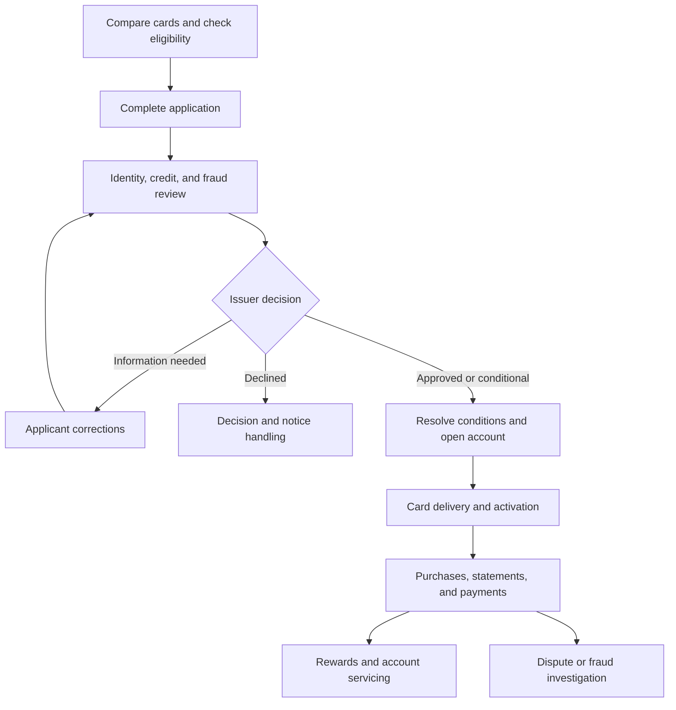

# Personal Credit Cards — Detailed User Journey

I reviewed the [PersonalCreditCards workspace](https://www.xenhey.com/api/store/7243BC08276A404CB447E2B6F8C66229), inspected **34 product pages—13 customer pages and 21 issuer-operations pages—and walked through all ten application steps**. I also checked the authorized-user branch and a transaction’s View action.

The journey below covers the product’s navigation and intended handoffs. **Observed screens and fields are identified directly; recommended outcomes do not imply that backend processing is implemented.** No application, payment, reward redemption, or issuer decision was submitted.

## 1. Overall journey

The product has three principal users:

| User                         | Primary objective                                                                                    |
| ---------------------------- | ---------------------------------------------------------------------------------------------------- |
| Applicant                    | Compare cards, complete an application, provide evidence, and receive an issuer decision.            |
| Cardholder                   | Manage the card, purchases, statements, payments, rewards, and service requests.                     |
| Issuer operations specialist | Verify applications, assess credit and fraud, record decisions, open accounts, and handle servicing. |

This is the recommended operating sequence supported by the available pages. Approval, account opening, fulfillment, and activation should remain separate stages.

## 2. Discover the product and compare cards

Open the [Personal Credit Cards introduction](https://www.xenhey.com/api/store/19902B2A13904D4DA03D4DEF408EF4B9).

The applicant compares three products:

| Product             | Displayed purpose   |
| ------------------- | ------------------- |
| Cash Back Card      | Everyday purchases. |
| Travel Rewards Card | Travel benefits.    |
| Low-Rate Card       | Balance management. |

The comparison presents annual fees, purchase APR, rewards, and balance-transfer availability. Actual terms are pending issuer configuration.

### Applicant walkthrough

1. Review the three product descriptions.
2. Compare intended use with personal spending and repayment needs.
3. Read the available issuer disclosures.
4. Select **Check eligibility**, **Start application**, or a product’s **Select and apply** action.
5. Confirm the requested product inside the application.

The [Product Catalog](https://www.xenhey.com/api/store/AF1EF7DFD5754E6289D4787214A96410#catalog) provides an exit to other financial products. Those separate products are outside this Personal Credit Cards journey.

### Eligibility

Open [Eligibility](https://www.xenhey.com/api/store/6E73FBA9C32743B4851BB6E8910C61A0).

Observed fields include:

* Residential state.
* Employment status.
* Annual-income band.
* Monthly-housing-payment band.
* Requested product.
* Contact email.

The user can load a representative sample, save a draft, or save a JSON record.

**Intended outcome:** establish preliminary application information. Saving eligibility information is not evidence of prequalification, approval, or a completed credit check.

---

## 3. Complete the ten-step application

Open [Apply for a Card](https://www.xenhey.com/api/store/A951744981384711AF262D1DA483792A).

The wizard displays an application reference, last-saved indicator, completion percentage, missing-information summary, and **Previous**, **Save and exit**, and **Continue** controls.

### Step-by-step walkthrough

| Step                         | Observed fields and actions                                                                                                                                          | Intended result                                                                 |
| ---------------------------- | -------------------------------------------------------------------------------------------------------------------------------------------------------------------- | ------------------------------------------------------------------------------- |
| **1. Applicant information** | First, middle, and last name; date-of-birth verification status; identity-verification status; email; mobile number.                                                 | Establish the applicant record and verification requirements.                   |
| **2. Address**               | Residential city/state, housing status, years-at-address band, and whether mailing and residential addresses match. Separate mailing city/state fields are provided. | Establish residence and correspondence information.                             |
| **3. Employment and income** | Employment status/category, annual-income band, income source, monthly-housing-payment band.                                                                         | Supply categorized repayment-capacity information for issuer review.            |
| **4. Card selection**        | Requested product, requested-credit-limit band, balance-transfer interest, authorized-user interest.                                                                 | Record the desired card and features.                                           |
| **5. Financial profile**     | Existing-monthly-debt band, bankruptcy-history status, credit-review authorization acknowledgment.                                                                   | Capture additional information required for the issuer’s assessment.            |
| **6. Authorized users**      | Optional request toggle; when enabled, authorized-user reference, relationship, and requested spending-limit band appear.                                            | Request an additional authorized user for issuer consideration.                 |
| **7. Documents**             | Identity-, income-, and address-document statuses; secure-channel acknowledgment.                                                                                    | Track evidence requirements without storing document contents in the prototype. |
| **8. Disclosures**           | Application, pricing/terms, rewards, and privacy disclosure acknowledgments, each labeled version `v2026.09`.                                                        | Associate the application with the disclosures presented.                       |
| **9. Consent**               | Electronic delivery, credit-review authorization, terms acknowledgment, and sensitive-data acknowledgment.                                                           | Record the appropriate consents through the approved process.                   |
| **10. Review and submit**    | Accuracy certification and a section-by-section summary with **Edit** links. Final action: **Submit application**.                                                   | Allow correction before sending the completed application for review.           |

### Conditional branches

**Different mailing address:** the Address step includes a same-address control and states that mailing fields are hidden when addresses match. A complete implementation should clear or appropriately retain outdated mailing data when this selection changes.

**Authorized user requested:** I verified that enabling the request reveals:

* Authorized-user reference.
* Relationship: spouse/partner, family member, or other.
* Spending-limit bands from under $1,000 to $5,000 or more.

The prototype still reports that the step is ready when those newly displayed fields are blank. Required-field behavior therefore needs clarification.

**Balance-transfer interest:** the field currently renders as a numeric input. The journey needs to distinguish whether it asks for interest in a transfer, a proposed amount, or another value.

### Recommended submission behavior

A completed application flow should:

1. Validate every required step.
2. Show unresolved issues beside the relevant section.
3. Preserve the application reference.
4. Retain the applicable disclosure versions and consent records.
5. Confirm successful submission.
6. Display the next action in Application Status.
7. Prevent duplicate submissions.

I verified navigation and the review screen, but did not test submission, saved-draft persistence, or issuer integration.

---

## 4. Return to an application and resolve requests

### Dashboard entry

The [Customer Dashboard](https://www.xenhey.com/api/store/7243BC08276A404CB447E2B6F8C66229) includes application-record tables alongside an illustrative active-account experience.

A returning applicant:

1. Searches for the relevant record.
2. Filters by status.
3. Selects **Edit in intake** or **Open**.
4. Confirms the application reference.
5. Updates the requested section.
6. Saves and returns later or submits through the appropriate workflow.

The page contains both `PPR-…` sample records and `PCC-…` applications. They use different status models and should not be assumed to be synchronized.

### Application Status

Open [Application Status](https://www.xenhey.com/api/store/734352F46D5041A38F0AEDDCF6F14D63).

The screen presents:

* Selected card and requested-limit band.
* Completion percentage.
* Current review stage.
* Last-saved time.
* Application reference.
* Timeline.
* Outstanding document request.
* **Continue application** and **Provide documents** links.

The representative scenario is in credit review with an outstanding income-document request. The page states that balances are shown only after activation.

### Documents

Open [Documents](https://www.xenhey.com/api/store/F5EED28E8A444AB3AC2E95950E1B47BB).

The form records identity-, income-, and address-document statuses and a secure-document acknowledgment.

**Recommended request-resolution journey:**

1. Issuer identifies the specific missing evidence.
2. Applicant sees the request in Application Status.
3. Applicant supplies evidence through an authenticated document channel.
4. Issuer validates it.
5. The request is cleared or returned with a specific explanation.
6. Application review resumes.

The actual document-upload channel and evidence processing were not verified.

---

## 5. Issuer journey: Application review and decision

### Queue and application context

| Linked page                                                                              | Reviewer journey                                                                                                |
| ---------------------------------------------------------------------------------------- | --------------------------------------------------------------------------------------------------------------- |
| [Admin Dashboard](https://www.xenhey.com/api/store/656E36D51DD7404399C834D1731F3C9D)     | Review new applications, credit/fraud queues, and account-opening workload; open the queue requiring attention. |
| [Applications](https://www.xenhey.com/api/store/00961F5325CF4553969136CEABA8A66D)        | Search and filter applications, then open the relevant record.                                                  |
| [Application Details](https://www.xenhey.com/api/store/2BDAF6FD6D4C4710BCE21002761A052E) | Confirm application reference, review status, decision field, and notes.                                        |

The recommended behavior is to preserve the selected application across every review page and keep internal assessments separate from customer-facing status.

### Identity, credit, and fraud

| Linked page                                                                          | Observed information                                                                               | Intended outcome                                           |
| ------------------------------------------------------------------------------------ | -------------------------------------------------------------------------------------------------- | ---------------------------------------------------------- |
| [Identity Review](https://www.xenhey.com/api/store/BF233C6E47B841419853E340D47C9F15) | Identity, address, sanctions-screening statuses; identity decision; notes.                         | Resolve identification and verification requirements.      |
| [Credit Review](https://www.xenhey.com/api/store/5939D68930CB4EF5B6E27E3089CB6E3D)   | Income considered, housing payment, obligations, requested limit, capacity rating, recommendation. | Record an authorized credit assessment and recommendation. |
| [Fraud Review](https://www.xenhey.com/api/store/C379DAE49C254A46AAE9A602FA0268C3)    | Device, email, address risk, application velocity, fraud decision, notes.                          | Clear, investigate, or escalate fraud concerns.            |

The forms offer draft and review-decision saving. Their presence does not prove that identity, screening, credit, or fraud services executed.

### Underwriting Decision

Open [Underwriting Decision](https://www.xenhey.com/api/store/AC266DE6FC9447A2872F53CF6892CB66).

Observed fields:

* Application reference.
* Approved product.
* Decision.
* Approved limit.
* Pricing-configuration reference.
* Conditions.
* Decision date.

**Recommended reviewer sequence:**

1. Confirm that required reviews are complete.
2. Resolve or document exceptions.
3. Record the authorized decision.
4. Specify approved product, limit, and pricing.
5. Document conditions.
6. Communicate the outcome through the approved issuer process.
7. Advance eligible applications to account opening.

Requested terms must remain distinct from approved terms.

### Declined or other adverse-action branch

Open [Adverse Action](https://www.xenhey.com/api/store/EB81783EDA4D4D5A9E035E791C840F3F).

The page captures action type, specific reasons, notice method/date, delivery status, and reviewer.

The intended journey is to record the issuer’s authorized action, prepare the appropriate communication through its approved process, and track delivery. Notice generation and delivery were not tested, and this screen alone does not establish compliance.

---

## 6. Account opening, delivery, and activation

| Linked page                                                                           | Observed fields                                                                                                              | Intended handoff                                       |
| ------------------------------------------------------------------------------------- | ---------------------------------------------------------------------------------------------------------------------------- | ------------------------------------------------------ |
| [Account Opening](https://www.xenhey.com/api/store/FC9D302A62154504953C7555945EC774)  | Application/account references, masked account identifier, approved limit, pricing reference, billing cycle, account status. | Establish the approved account with the correct terms. |
| [Card Fulfillment](https://www.xenhey.com/api/store/D08E050F2F154BB18CAD6207EA3F8D12) | Masked card reference, product, fulfillment status, shipping method, expected delivery.                                      | Produce and deliver the approved card.                 |

The application table includes **Awaiting activation** as a distinct status.

### Recommended activation journey

1. Resolve approval conditions.
2. Establish the account.
3. Configure approved pricing, limit, and billing cycle.
4. Fulfill the card.
5. Notify the applicant of delivery and activation instructions.
6. Complete activation through the authenticated issuer process.
7. Enable the active-account experience.

The customer Card & Controls page is labeled for controls and activation, but I did not find or verify a dedicated activation action in the inspected screen.

---

## 7. Active-cardholder dashboard

The dashboard displays sample values for:

* Current balance.
* Available credit.
* Pending purchases.
* Statement balance.
* Minimum due and due date.
* Scheduled autopay.
* Rewards.
* Recent purchases and alerts.

It provides actions for **Make a payment**, **View statement**, **Manage card**, transaction history, and application history.

### Daily-use journey

1. Review available credit and recent activity.
2. Check alerts and pending purchases.
3. Open Transactions to investigate a purchase.
4. Open Statements to review the billing period.
5. Open Payments to review a scheduled payment or prepare one.
6. Open Card & Controls for a security or card-management action.
7. Use Rewards or Support as needed.

The active account and pending application should remain visibly separate, particularly when a customer has both.

---

## 8. Card management and profile

### Card & Controls

Open [Card & Controls](https://www.xenhey.com/api/store/0ABF297B5C4445A8B8AD6C6DE4A36A97).

Observed controls include:

* Masked card reference and active status.
* **Lock card**.
* **Report lost or stolen**.
* Alert enrollment.
* International use.
* Digital-wallet request.
* Replacement preference.

**Recommended journey:** select the correct card → review the action → authenticate where required → apply the change through the issuer → receive confirmation and an audit reference.

Card locking, wallet provisioning, replacement, and activation were not executed.

### Profile

Open [Profile](https://www.xenhey.com/api/store/E62B24C4CBE943F5A42C1884389DDB7D).

The form contains name, email, mobile number, residential city/state, and communication preference.

A completed flow should validate contact changes, apply any required verification, and maintain history. Changing profile information should not silently replace previously verified identity information.

---

## 9. Transactions and statements

### Transactions

Open [Transactions](https://www.xenhey.com/api/store/BDAFF5231414446A9909F1946065F4A0).

The screen contains:

* Posted-purchase and pending-purchase summaries.
* Rewards earned.
* Open-dispute count.
* Search, status/date filters, CSV export, and pagination.
* Transaction date, merchant/reference, status, category, amount, and **View** action.

**Recommended walkthrough:**

1. Filter to the desired date range.
2. Search for the merchant.
3. Select the transaction.
4. Review pending versus posted status.
5. Compare the charge with receipts or expectations.
6. Route an issue to the appropriate billing-dispute or fraud process.

**Verified limitation:** clicking the first transaction’s **View** button displayed “Transaction details opened,” but I did not observe a detail panel or new detail page. A notification alone does not complete this journey.

### Statements

Open [Statements](https://www.xenhey.com/api/store/71D261D7E4434CF0B0C3F2236C3A1F8C).

The page lists monthly periods with statement balance, minimum due, due date, and View/Download actions. It also offers **Paperless settings**, search/filter controls, and CSV export.

**Cardholder journey:**

1. Select the billing period.
2. Open or download the statement.
3. Review purchases, credits, balances, and payment requirements.
4. Navigate to Payments if action is needed.
5. Raise a billing question through Support if something appears incorrect.

Statement rendering, download contents, and paperless-setting persistence were not tested.

---

## 10. Payments and autopay

Open [Payments](https://www.xenhey.com/api/store/EC1C95C8501F448CB14431740B4CE676).

This page provides a clearer payment-specific flow than many other forms.

Observed fields include:

* Amount choice: statement balance, minimum due, current balance, or other.
* Other amount.
* Securely linked funding source.
* Payment date.
* Payment status: Draft, Scheduled, or Processing.

The sample page warns that a payment is already scheduled and asks the customer to review it before creating another.

### Payment walkthrough

1. Review statement balance, minimum due, and existing scheduled payments.
2. Choose the intended payment amount.
3. Select a securely linked funding source.
4. Select an available date.
5. Choose **Review payment**.
6. Review notices and details.
7. Authorize through the approved payment process.
8. Receive a confirmation/reference.
9. Track Scheduled → Processing → posted confirmation.

The page explicitly distinguishes submission from posting. A scheduled payment should not immediately appear as a posted payment.

### Autopay journey

1. Select **Manage autopay**.
2. Review the existing amount rule, source, and schedule.
3. Request changes through the approved authorization process.
4. Confirm when the change takes effect.
5. Recheck any existing scheduled payment to avoid duplication.

Payment authorization, posting, and autopay changes were not executed.

---

## 11. Rewards and support

### Rewards

Open [Rewards](https://www.xenhey.com/api/store/33C80CA7D9A042E6B2360D9EF13A6919).

The screen distinguishes available, earned, redeemed, pending, and expiring points. The form contains program, available points, redemption type, amount, and status.

**Recommended journey:**

1. Review available points separately from pending points.
2. Explore issuer-approved redemption choices.
3. Choose the redemption type and amount.
4. Review value and conditions.
5. Authorize redemption.
6. Receive confirmation.
7. Track completion and updated rewards balance.

The current Redemption Type dropdown uses generic verification statuses; actual redemption choices need implementation.

### Support

Open [Support](https://www.xenhey.com/api/store/F49A6ABAE73847238F9FF0DA9A3D8700).

The current page exposes application reference, review status, decision, and notes. It does not present a conventional customer-support intake.

**Recommended support journey:** select issue category → identify the account/transaction → describe the problem → receive a case reference → track updates and resolution.

That customer-facing case flow remains a gap in the inspected interface.

---

## 12. Ongoing issuer operations

The following completes the administrative link inventory.

| Linked page                                                                                 | Observed information                                                                                              | Intended operational journey                                                      |
| ------------------------------------------------------------------------------------------- | ----------------------------------------------------------------------------------------------------------------- | --------------------------------------------------------------------------------- |
| [Servicing](https://www.xenhey.com/api/store/DCB73E217A5F47A796DC20FEA2D1E588)              | Request type, account, status, effective date, notes.                                                             | Receive request → verify authority → resolve or escalate → communicate outcome.   |
| [Transaction Review](https://www.xenhey.com/api/store/DC482CD335E549E7B5B059FF98A3BAA6)     | Transaction reference, merchant, amount, status, risk flag, decision.                                             | Inspect the purchase and supporting signals → record the authorized disposition.  |
| [Payment Operations](https://www.xenhey.com/api/store/AA1A8E69760B4AC4A244881FF5D79255)     | Payment/provider references, masked source, amount, status, effective date.                                       | Reconcile payment processing → investigate exceptions → confirm posting outcomes. |
| [Billing Disputes](https://www.xenhey.com/api/store/7ECA485A54554BD5B7E7BEA9870B322A)       | Statement/transaction references, error type, amount, receipt/acknowledgment dates, investigation and resolution. | Register the billing issue → investigate → record and communicate resolution.     |
| [Fraud Cases](https://www.xenhey.com/api/store/74377B4EBBFB47C3B0C3A0888964B485)            | Case/transaction references, type, status, provisional-credit and contact statuses.                               | Investigate suspected unauthorized activity and track the case outcome.           |
| [Lost or Stolen Cards](https://www.xenhey.com/api/store/E1DA373A85FF40A988A47A56404A8B86)   | Masked card, report date/type, card/replacement status, wallet-token status.                                      | Protect the card → assess wallet tokens → arrange replacement → confirm status.   |
| [Delinquency](https://www.xenhey.com/api/store/F43D9DAE750B4574A1E98D233D4A20A3)            | Days past due, amount, contact/workout statuses, next-action date.                                                | Review overdue account → follow authorized servicing process → track follow-up.   |
| [Rewards Administration](https://www.xenhey.com/api/store/086960C025AB488B9C5A8F4C822F5114) | Program, earning/redemption rules, adjustment amount/reason, approval.                                            | Maintain rules → review adjustments → reconcile rewards outcomes.                 |
| [Reports](https://www.xenhey.com/api/store/A9B388804FF94B129A444961B04CA81C)                | Report type, dates, product, decision, risk tier.                                                                 | Define reporting scope → generate approved output → investigate exceptions.       |
| [Administration](https://www.xenhey.com/api/store/9087EA41779146BB8812AEF1229EABA2)         | User name/email, role, account status, MFA, session timeout.                                                      | Authorize staff access and security settings → audit changes.                     |
| [Audit History](https://www.xenhey.com/api/store/2643C10956564610A6DC6B3F80E1019C)          | Event type, actor, date range, record reference.                                                                  | Retrieve relevant events and support operational investigations.                  |

These screens were inspected, but their save buttons do not prove external processing, reporting, authorization enforcement, or durable audit logging.

---

## 13. Alternate and exception journeys

| Scenario                          | Customer action                                                                | Issuer handoff                                                                         |
| --------------------------------- | ------------------------------------------------------------------------------ | -------------------------------------------------------------------------------------- |
| Missing income evidence           | Open Application Status and supply evidence through the authenticated channel. | Validate evidence and resume credit review.                                            |
| Identity mismatch                 | Respond to a specific verification request.                                    | Resolve the discrepancy or escalate.                                                   |
| Conditional approval              | Review and satisfy the stated conditions.                                      | Verify completion before permitted account-opening activities.                         |
| Declined application              | Review the issuer’s communication.                                             | Complete authorized decision and notice handling.                                      |
| Lost or stolen card               | Report through Card & Controls.                                                | Coordinate card protection, replacement, wallet-token review, and related fraud cases. |
| Unrecognized purchase             | Identify the transaction and report the issue.                                 | Route to fraud investigation or billing dispute as appropriate.                        |
| Duplicate scheduled payment       | Review existing payments before authorizing another.                           | Handle adjustment/cancellation through the supported payment process.                  |
| Payment failure or overdue amount | Review payment status and contact support.                                     | Investigate payment exceptions and coordinate servicing follow-up.                     |
| Rewards discrepancy               | Identify the relevant activity and raise a request.                            | Review program rules and authorized adjustments.                                       |

## 14. Priority fixes revealed by the walkthrough

| Observed issue                                                                  | Journey impact                                                                | Recommended correction                                                              |
| ------------------------------------------------------------------------------- | ----------------------------------------------------------------------------- | ----------------------------------------------------------------------------------- |
| Requested Product and Requested Credit Limit Band render as checkboxes.         | Applicants cannot clearly select a product or limit band.                     | Use appropriate product and limit selectors.                                        |
| Balance Transfer Interest renders as a numeric field.                           | Its meaning is unclear.                                                       | Separate interest selection from any proposed transfer amount.                      |
| Authorized-user details remain optional after the branch is enabled.            | An incomplete request may appear ready.                                       | Define conditional validation rules.                                                |
| PPR and PCC records coexist with different status models.                       | Users may edit the wrong application source.                                  | Establish a primary record identity and label demo sources clearly.                 |
| Transaction View produces a notification without an observed detail surface.    | The purchase-investigation journey stops.                                     | Open a detail panel/page with the selected transaction context.                     |
| Support displays review/decision fields.                                        | Customers lack a usable issue-reporting flow.                                 | Provide category, description, record linkage, case reference, and tracking.        |
| Several decision, role, preference, and redemption fields use generic statuses. | Choices do not match the question.                                            | Define field-specific options and separate verification from business outcomes.     |
| Disclosure version labels are present.                                          | Labels alone do not establish disclosure presentation or acceptance evidence. | Connect the actual documents and retain versioned consent records.                  |
| Customer forms expose verification statuses.                                    | Self-entered values could be mistaken for issuer verification.                | Keep authoritative verification outcomes controlled by authorized issuer processes. |

For a complete demonstration, use one synthetic applicant from card comparison through review, decision, delivery, and activation, then show a purchase, statement, payment, and service case while preserving the same application and account context.
