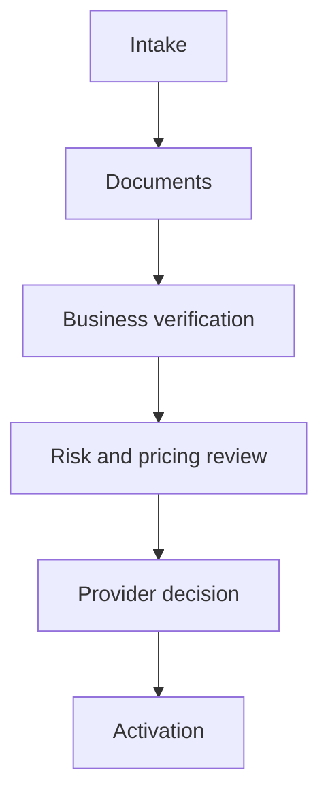

## Merchant Services UI examples

### 1. Merchant dashboard

A customer-facing landing page similar to your current [Xenhey Merchant Services dashboard](https://www.xenhey.com/api/store/57CC7857B9F24BF2A121D6C192E07BD9).

Include:

* Application status and progress
* Monthly processing volume
* Deposits awaiting settlement
* Open information requests
* Chargebacks and refunds
* PCI compliance status
* Recent activity
* “Continue application” action

### 2. Merchant onboarding wizard

Use a multi-step intake form:

1. Business information
2. Ownership and control
3. Products and services
4. Processing volume
5. Sales channels
6. Fraud and chargeback controls
7. PCI readiness
8. Settlement account
9. Equipment and integration
10. Agreements and submission

Each step should show completion status, validation errors, Save Draft, Previous and Continue buttons.

### 3. Application records table

| Application | Merchant        | Channel      | Status              | Monthly volume | Updated | Action   |
| ----------- | --------------- | ------------ | ------------------- | -------------: | ------- | -------- |
| MS-10421    | Metro Café LLC  | Card present | Risk review         |      $25K–$50K | Sep 11  | Edit     |
| MS-10422    | Horizon Retail  | E-commerce   | Draft               |     $50K–$100K | Sep 10  | Continue |
| MS-10423    | Greenway Dental | Recurring    | Documents requested |      $10K–$25K | Sep 9   | Upload   |

Recommended controls:

* Keyword search
* Status and channel filters
* Date range
* Sortable columns
* Edit/Continue action
* CSV export
* Pagination
* Create Application button

### 4. Processing profile

Provide cards and charts for:

* Monthly card volume
* Average and maximum ticket
* Card-present percentage
* E-commerce percentage
* Recurring payments
* International payments
* Refund and chargeback rates
* Seasonal volume patterns

### 5. Pricing and settlement

Display:

* Interchange-plus or flat-rate pricing
* Transaction fees
* Monthly platform fees
* Chargeback fees
* Equipment costs
* Reserve requirements
* Expected funding schedule
* Settlement-account verification
* Pricing acknowledgment

### 6. Equipment and integration

Use selectable product cards for:

* Countertop terminal
* Wireless terminal
* Mobile reader
* Smart POS
* Virtual terminal
* Hosted checkout
* E-commerce plug-in
* Custom API integration

Each card should show availability, price, compatibility and setup status.

### 7. Application-status tracker

Show completed, active, blocked and upcoming stages with dates and outstanding tasks.

### 8. Admin application pipeline

Operations users need:

* Applications by stage
* Assigned reviewer
* Days in current stage
* Risk level
* Missing documents
* SLA warning
* Provider submission status
* Approval or decline decision
* Bulk assignment and export

### 9. Underwriting workspace

Use a three-column layout:

* Left: merchant profile and navigation
* Center: selected review form
* Right: risk alerts, missing information and reviewer notes

Recommended actions:

* Approve
* Conditionally approve
* Request information
* Place on hold
* Escalate
* Decline

### 10. Merchant monitoring dashboard

After activation, display:

* Transaction volume
* Approval rate
* Refund rate
* Chargeback ratio
* ACH return rate
* Fraud alerts
* Settlement exceptions
* PCI expiration
* Volume variance
* Merchant risk tier

A strong overall design direction would combine a Stripe-style clean dashboard, a Square-style guided merchant experience, and an Adyen-style operational review workspace.
